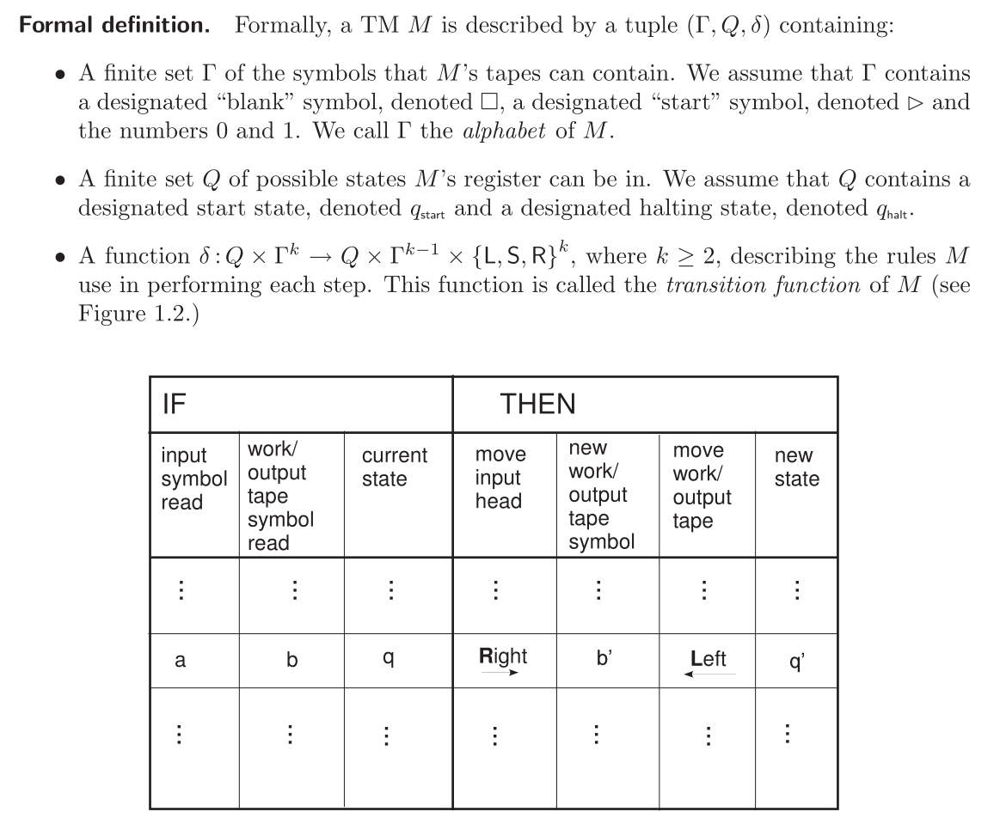

**疑问**

1. P21, Claim 1.8, 为什么标准图灵机模拟双向图灵机的时间是 $4T(n)$ ？

# 1 - 计算模型

> 以及为什么它不重要

**计算模型**，捕捉所有解决计算任务的计算方法的数学模型。

**图灵机**，一个简单的数学模型，足以研究许多关于计算及其效率的问题。

## 1.1 建模计算

> What you really need to know

**“计算”**，应用机械规则来操纵数字，进行操纵的人/机器可以在便签簿上写中间结果。*图灵机是这一直观概念的具体体现*。

非正式的描述：

设 $f$ 是一个函数，输入为位串（集合$\{0,1\}^*$的一个元素），输出为 0 或 1。计算 $f$ 的算法是一组机械规则，遵循这些规则可以由给定的任意输入 $x\in\{0,1\}^*$ 计算 $f(x)$。规则集合是固定的，相同的规则适用于所有可能的输入，尽管每个规则可以应用任意多次。每个规则涉及以下一个或多个“基本”操作：

1. 读输入的一位
2. 从“便签簿”或允许算法使用的工作空间中读一位
3. 写一位/符号到便签簿
4. 停止或者输出 0 或 1，或者选择集合中的一个新的规则应用

运行时间是执行这些基本操作的次数。使用渐近术语衡量，即如果一台机器在长度为 n 的输入上最多执行 T(n) 次基本操作，它就会在时间 T(n) 内运行。

几个事实：

1. 该模型对定义中的几乎任何调整都是稳健的
2. 一旦我们决定了某种规范的编码，算法(即机器)就可以表示为一个位串。因此，一个算法/机器可以被视为另一个算法的可能输入——这使得输入、软件和硬件之间的边界非常灵活
3. 有一个通用的图灵机 U，给定它的位表示，它可以模拟任何其他图灵机
4. 前面两个事实可以用来很容易地证明任何图灵机都无法计算的函数的存在

## 1.2 图灵机

k-纸带图灵机通过以下方式具体实现了上述非正式概念：

图灵机的主要组成部分是纸带、读写头、状态寄存器和规则。

### 1.2.1 图灵机的表达能力

**binary-to-unary conversion**，由二进制转为一进制，如 1001 转为 `*********`。

## 1.3 效率和运行时间

形式化运行时间的概念。因为每一个非平凡的计算任务至少需要读取整个输入，所以将基本步骤的数量作为输入长度的函数进行计数。

**定义 1.3** *（计算一个函数和运行时间）*，令 $f:\{0,1\}^*\rightarrow\{0,1\}^*$和 $T:\mathbb{N}\rightarrow\mathbb{N}$ 是函数，并且 $M$ 是一个图灵机，如果对于每个 $x\in\{0,1\}^*$，$M$ 停止时将 $f(x)$ 写在输出纸带上，则称 $M$ 计算 $f$ 。如果对每个输入 $x$ 的计算需要最多 $T(|x|)$ 步，则称 $M$ 计算 $f$ 在 $T(n)$ 时间内完成。

**时间可构造函数（Time-constructible functions）**，对于一个函数 $T:\mathbb{N}\rightarrow\mathbb{N}$，如果 $T(n)\ge n$ 并且存在一个图灵机 $M$ 使得对于输入 $x$，能够在时间 $T(n)$ 内计算出 $T(|x|)$ 的二进制表示，则称 $T$ 为时间可构造函数。限制 $T(n)\ge n$ 是为了算法有时间读取输入。*“我认为是为了让图灵机可以在指定的时间内停止，当时间依赖于输入的长度时，若计算时间花费的时间大于指定的时间本身，就会导致无法在预期的时间自动停止”*。

### 1.3.1 定义的稳健性

如果我们愿意忽略运行时间中的多项式因子，那么精确的模型并不重要。研究模型的变化包括限制字符集为 $\{0,1,\square,\rhd\}$，限制机器只有一个工作磁带，或允许磁带在两个方向上都是无限的。不仅一个模型可以模拟另一个模型，而且它可以有效地模拟另一个模型。

其中**健忘图灵机**因为用间隔来模拟多纸带，所以读写头每次都要移动，因此健忘。

## 1.4 机器作为字符串以及通用图灵机

我们可以把一个图灵机表示成一个字符串：只要把 TM 的描述写在纸上，把这个描述编码成一串 0 和 1。这个字符串可以作为另一个 TM 的输入。它模糊了软件、硬件和数据之间的区别，推动了通用电子计算机的发明，这是一个单一的机器，可以通过加载适当的程序(软件)来适应任何任务。

由于图灵机的行为是由其转移函数决定的，我们将使用该函数的所有输入和输出的列表(可以很容易地在 $\{0,1\}^*$ 中编码为字符串)作为图灵机的编码。假设我们的表示方案满足以下性质：

1. $\{0,1\}^*$ 中的每个字符串都表示某个图灵机

   > 可以将非有效编码的字符串映射到规范的普通 TM 中确保，例如在任何输入上立即停止并输出零的 TM

2. 每个 TM 都可以用无限多的字符串来表示

   > 可以指定表示可以由任意多的 1 结尾

### 1.4.1 通用图灵机

其中 $logT$ 是因为对于要执行 $T$ 步骤的计算时，至多要在工作纸带上使用 $logT$ 位标识当前状态，所以每步要乘 $logT$。

实现举例，在工作纸带上记录当前状态，然后在图灵机描述纸带上，根据当前输入和状态搜索匹配的规则，完成动作（动作也是编码的，因此 UTM 可以执行），然后在工作纸带上写入下一个状态，继续循环直到停机。

**带时间限制的通用图灵机**，添加计时器，可以当模拟的图灵机在指定时间内停机时才输出结果。

## 1.5 不可计算性

存在不能在任何有限步数内计算的函数。存在一些范围是 $\{0,1\}^*$ 的这样的函数，换句话说，这样的函数表示一些 *languages*（判定一串字符是否属于一个语言，因此可以代表一个 *language*），这样的一个 *language* 被称为是不可判定的（*undecidable*）。

证明中的 $M$ 可以替换为 UC 本身，依然可以得到矛盾的结果，即 UC 无法计算 UC 本身。

### 1.5.1 停机问题

函数 HALT 的输入为一个对 $<\alpha,x>$，输出为 1 当且仅当计算 $M_\alpha(\alpha)$ 在有限步内停机。这个函数可以确定地判断一个计算机程序是否可以在给定输入时进入无限循环。如果计算机可以计算停机函数，设计没有 bug 的软件和硬件就会非常简单。然而即使允许运行任意长的时间，停机函数也是不可计算的。

这样的证明技术被叫做*规约（reduction）*。计算 UC 可以规约为计算 HALT。规约还可以用来通过给定一个解决问题 B 的过程，提出一个解决问题 A 的算法，来说明问题 B 至少和问题 A 一样困难。

许多有趣的不可计算（也称作不可判定）的问题：丢番图方程等。

### 1.5.2 哥德尔定理（Gödel's Theorem）

**Soundness** means that you *cannot* prove anything that's wrong.

**Completeness** means that you *can* prove anything that's right.

**哥德尔不完备定理**：对于每个健全的公理和推理规则的系统 $S$，都存在无法在 $S$ 中证明的定理陈述。也即具备健全性的系统必然不具备完备性。

**利用不可计算性的反向证明**：在一个足够强的公理系统中，对于任意输入 $<\alpha,x>$，可以写出数学陈述 $\phi_{<\alpha,x>}$ 当且仅当 HALT($<\alpha,x>$)=1。如果系统是 complete 的，则一定可以证明 $\phi_{<\alpha,x>}$ 或 $\neg\phi_{<\alpha,x>}$ 中的一个（因为完全性，所以为真的命题一定可以证明，而 $\phi_{<\alpha,x>}$ 不为真即为假），如果系统是 sound 的，则两者都不能证明（因为健全性，可以证明的一定为真，而由于停机函数的不可计算性，因此无法证明 $\phi_{<\alpha,x>}$ 的真假性）。因此如果系统既满足完全性又满足健全性，则停机问题的算法可以对于所有输入都在有限时间内终止（因为完全性保证 $\phi_{<\alpha,x>}$ 可以被证明，而健全性确保能够被证明的一定为真，因此一定存在停机函数的可计算算法）。

**[Soundness and Completeness](https://math.stackexchange.com/questions/105575/what-is-the-difference-between-completeness-and-soundness-in-first-order-logic)**

## 1.6 P 类问题（The class P）

**复杂类**（complexity class）是在给定的资源界限下可被计算的函数集合。

出于方便关注布尔函数，这些函数定义了判定问题（*decision problems*）或 *languages*。如果一个机器可以计算函数 $f_L:\{0,1\}^*\rightarrow\{0,1\}$，其中 $f_L(x)=1\Leftrightarrow x\in L$，则称这个机器可以判定 *language L*。

**定义 1.12（DTIME 类）**，令 $T:\mathbb{N}\rightarrow\mathbb{N}$，一个 *language L* 属于 DTIME($T(n)$) 当且仅当存在一个图灵机可以在时间 $c·T(n)$ 内运行并且判定 *language L*，其中 $c>0$ 是一个常量。

DTIME 中的 "D" 表示 "deterministic"。

**“高效计算”**，也即多项式的运行时间，即最多为 $n^c$，其中 $c>0$ 是一个常量。P 类中的 "P" 即 "polynomial"。

如图连通问题中，判断两个顶点是否连通就是一个 P 类问题。

### 1.6.1 为什么模型不重要

丘奇-图灵论文指出，每一种物理上可实现的计算设备，都可以通过图灵机进行模拟。这意味着，在任何其他计算模型上，可计算问题的集合都不会更大。（但是 CT 论文不是定理，仅仅是对我们目前理解的世界本质的一种信念）。*量子计算机除外，尽管目前尚未证明 $BQP\neq P$*。

 