**疑问**

1. P50 中，2.3.6 的第 2 点节俭性，是否可以理解为任意一个 NP-语言的一个元素的证明都是可数无穷的，因此和 SAT 的 size 相同？

# 2 - NP 与 NP 完全性

验证解决方案要比提出解决方案容易得多，因为后者需要创造性的努力。本章定义了一个复杂类 NP 旨在捕获解决方案可以被有效验证的问题集合，之前定义的 P 类问题则包含了可以被高效解决的判定问题。

## 2.1 NP 类

如果问题的解决方案可以在多项式时间内得到验证，则称是“有效可验证的”。

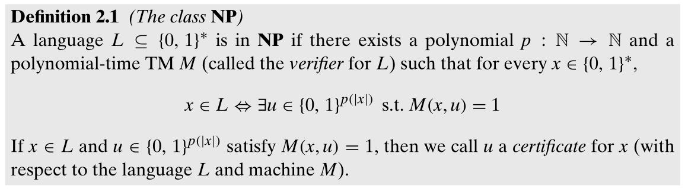

$u$ 为空字符串时可以证明 $\bf{P}\sube\bf{NP}$。

### 2.1.1 NP 和 P 之间的关系

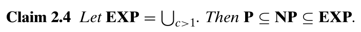

其中 $\bf{EXP}=\cup_{c\ge1}DTIME(2^{n^c})$。大多数研究者认为 $\bf P\neq NP$，因为多年来的努力都未能产生求解 NP 完全问题的高效算法。多项式时间的枚举在 $c\ge1$ 时近似指数时间，因此 $\bf NP\sube EXP$。

### 2.1.2 非确定图灵机

NDTM 和标准 TM 的唯一区别在于 NDTM 有两个转移函数，以及一个特殊的状态 $q_{accept}$。在每个计算步骤中，M任意选择应用它的两个转移函数中的一个，如果存在这些选择的序列使得 M 在输入 $x$ 上到达状态 $q_{accept}$，则 $M(x)=1$，否则 $M(x)=0$。如果 $M$ 可以由 $T(|x|)$ 步到达 $q_{accept}$，称 $M$ runs in $T(n)$ 时间。

类比 DTIME 的定义，有 NTIME：

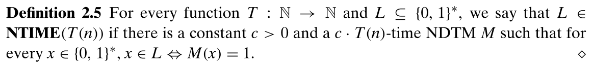

此时可以定义 NP 为：

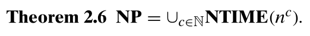

也即 NP 是存在一个可以在多项式时间内生成的解，而生成的过程可以看作是上一个定义中的证明（certificate）。

不同于标准 TM，NDTM 不打算模拟任何物理上可实现的计算设备。

## 2.2 可约性和 NP-完全性

独立集问题至少和其它 NP 问题一样难，如果它有一个多项式时间的算法，则这个算法也可以用于 NP 中的其他所有问题。这样性质被称为 NP-难。又因为大部分学者猜想 $\bf NP\neq P$，因此一个语言是 NP-难的，可以作为它不能再多项式时间内被判定的证据。

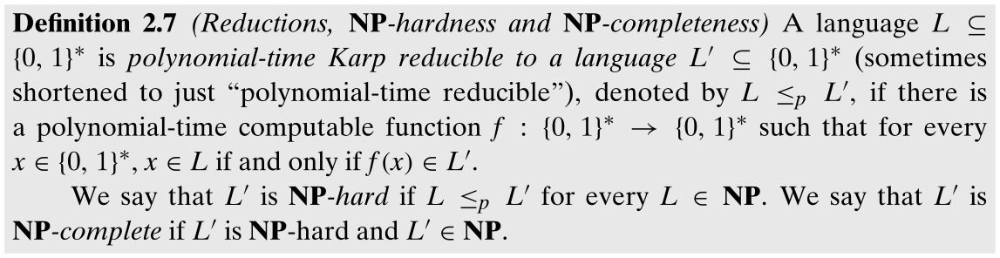

还可以得到，如果 $L\le_p L'$ 以及 $L'\in{\bf P}$，则 $L\in{\bf P}$。

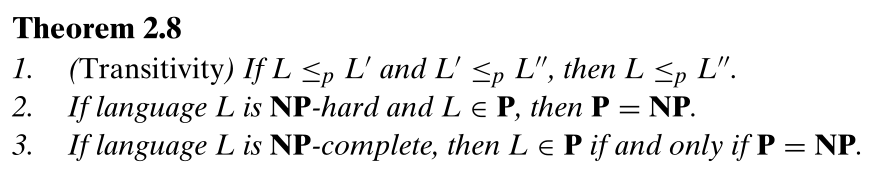

一个 NP-完全问题的实例：

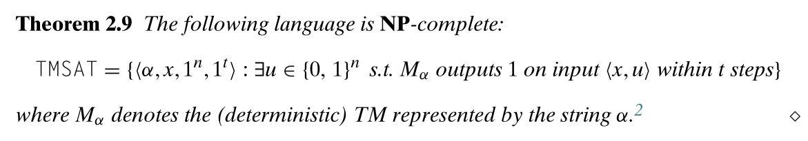

## 2.3 库克-列文定理：计算是局部的

### 2.3.1 布尔公式，CNF 和 SAT

对于一个由逻辑操作符和变量组成的布尔公式 $\phi$，如果存在赋值 $z$ 使得 $\phi(z)$ 为真，则称 $\phi$ 是可满足的，否则称它为不可满足的。

CNF 形式指，变量或其否定的或操作的与操作，即：

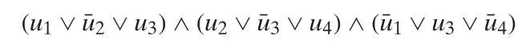

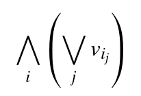

其中项 $v_{i_j}$ 称为 $literals$，项 $(\or_jv_{i_j})$ 称为 $clauses$。

kCNF 指所有的 $clauses$ 最多包含的 $k$ 个 $literals$ 的 CNF 公式。

SAT 为包含所有可满足的 CNF 公式的语言，3SAT 则为包含所有可满足的 3CNF 公式的语言。

### 2.3.2 库克-列文定理

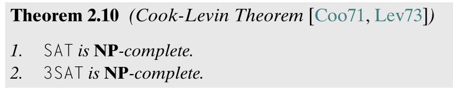

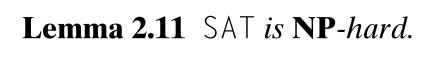

### 2.3.3 布尔公式的表达能力

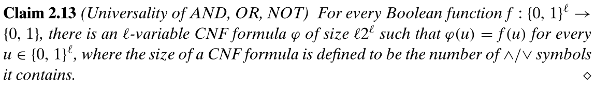

任何一个布尔函数，都可以用一个 CNF 公式表示。

### 2.3.4 Lemma 2.11 的证明

思路是利用可约性，将（健忘）图灵机执行验证的每个步骤，使用 SAT 表示，这样就可以将 $x$ 与图灵机在多项式时间内转换成 $\phi_x$，同时这个布尔公式存在一个赋值，也即证明 $u$，使得 $\phi_x$ 为真，也即得到的 $\phi_x$ 是可满足的，可以证明 $x\in L$。

### 2.3.5 规约 SAT 到 3SAT

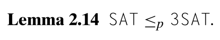

## 2.4 规约之网

为什么复杂性理论家擅长约简，但不擅长在图灵机上证明下限？也许人类的创造力更适合小工具制造和算法设计（毕竟，简化只是将一个问题转化为另一个问题的算法），而不是证明图灵机的下限。

## 2.5 判定与搜索

显然搜索问题要难于相应的判定问题，因此如果 $\bf P\neq NP$，则 NP-完全的两种问题都不能高效解决。但如果 $\bf P=NP$，则 NP 问题的搜索版本也可以在多项式时间内解决。

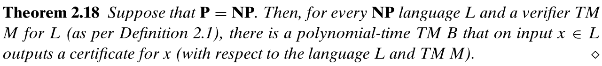

**向下自规约（downward self-reducible）**，SAT 是向下自规约的，即给定一个能够在小于 n 长度的输入上解决 SAT 的算法，那我们就可以解决在长度 n 上的 SAT 问题。

## 2.6 $\bf CONP, EXP$ 和 $\bf NEXP$

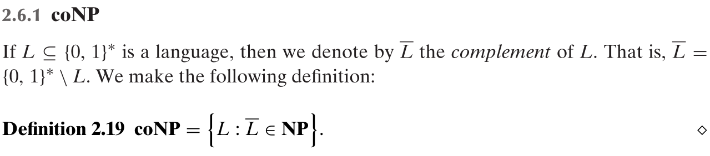

$\bf coNP$ 不是 $\bf NP$ 的补集，比如 $\bf P\sube(NP\cap coNP)$。$\bf coNP$ 语言的一个例子是 $\overline{\rm SAT}=\{\phi:\phi\rm{\ is\ not\ satisfiable}\}$，它不是 $\bf NP$ 的，因为对于一个可满足的公式，NDTM 不能在生成一个不能使公式为真的赋值时就确定公式不可满足。

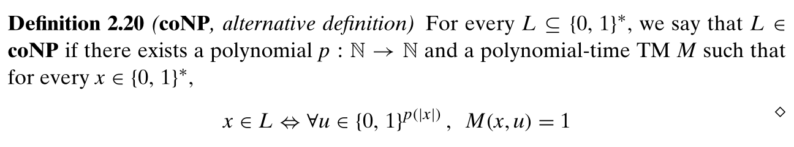

如果我们能证明 $\bf P=NP$，则 $\bf NP=coNP=P$；反之，如果我们可以证明 $\bf NP=coNP$，则 $\bf P\neq NP$。

### 2.6.2 $\bf EXP$ 和 $\bf NEXP$

类似 $\bf EXP$，可以定义 $\bf NEXP=\cup_{c\ge1}NTIME(2^{n^c})$。可以得到 $\bf P\sube NP\sube EXP\sube NEXP$。

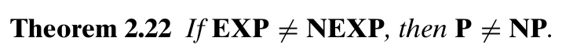

## 2.7 关于这些复杂类的想法

- 拉德纳定理表明，如果 $\bf P\neq NP$，则存在既不是 $\bf P$ 也不是 $\bf NP$-完全的问题。
- 若假设 $\bf P\neq NP$，NP-完全性仅意味着问题没有一个能够在每个输入上都能精确计算的算法，但大多数应用时，近似解已经足够好了。