**疑问**

1. P69, 3.1 前，$M_i$ 表示由 $i$ 的二进制表示的图灵机（不包括前导 1，without leading 1），其中不包括前导 1 是为何？

   > "这里是编码，而非数字表示，也就是说：01并不是代表1，而是编码01，0有具体的含义而非简单地计数。"

2. P86, 4.2.2, PSPACE-完全问题的类似概念似乎是一个有完美信息的两人游戏的获胜策略是什么意思？找到一条必胜路径就是 PSPACE-问题的本质吗？

   > "我理解，这里的获胜策略是说无论play2怎么走，play1都应应对的办法赢得比赛。但与时间NP复杂度不同，这里不单需要遍历各种方法，而且需要存储所有的结果。即：要确保“全胜”，各种可能的结果都需要列举（走）出来——存储是必须的。而对于NP来说，只需要找到一条可行路径即可。"

# 3 - 对角化

- 复杂性理论的一个基本目标是证明某些复杂性类（如 P 和 NP）是不一样的。为了做到这一点，需要一个类中的机器，它不同于另一个类中的每台机器。而对角化基本上是构造这种机器的唯一已知的通用技术。

- 仅对角化可能无法解决 P 与 NP 和其他有趣的问题；有趣的是，对角化的这些极限是用对角化本身来证明的。

- 所有对角化证明中使用的一个常用工具是用字符串表示图灵机。

## 3.1 时间层次定理

时间层次定理表明，允许图灵机有更多的计算时间严格地增加了他们可以判定的语言集。

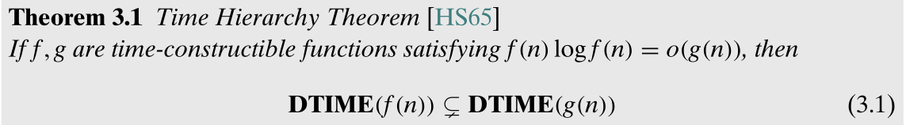

## 3.2 非确定时间层次定理

*个人理解：多一个可枚举的状态，会严格地增加可判定的语言集*。

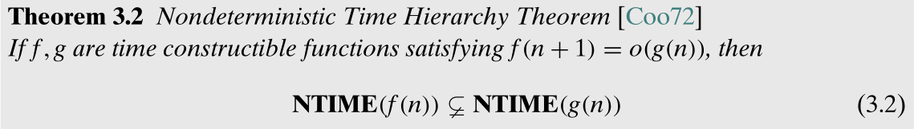

## 3.3 拉德纳定理：NP-中间问题的存在性

如果 $\bf P=NP$，则存在既不是 $\bf P$ 也不是 $\bf NPC$ 的问题。

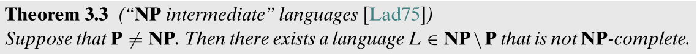

> 存在两个语言：因式分解和图同构语言。
>
> 目前还不知道这两个语言的多项式时间算法，并且很明显它们不是NP完全的。

## 3.4 预言机和对角化的极限

为了更具体，称“对角化”是仅依赖图灵机以下特性的任何技术：

1. 图灵机的字符串有效表示的存在性。
2. 一个 TM 模拟另一个 TM 的能力，在运行时间或空间上没有太多额外的开销。

任何只使用这些事实的论点都是把机器当成黑匣子：机器的内部工作无关紧要。

**预言机**定义为满足这两个属性的图灵机的变体（主要用于对角化）

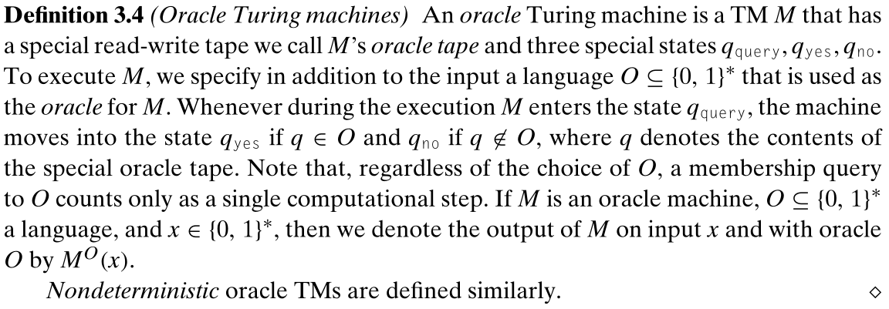

即可以在单步操作内判定任何语言 $O$ 的机器。

在拥有这样的预言能力后，可以定义相应的 ${\bf P}^O$ 和 ${\bf NP}^O$ 问题：

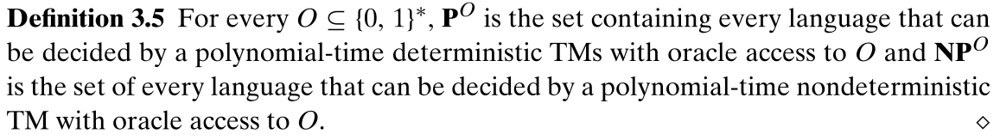

可以发现，不论是 $\bf P=NP$ 还是 $\bf P\neq NP$，使用对角化都不能得到相对的结果：

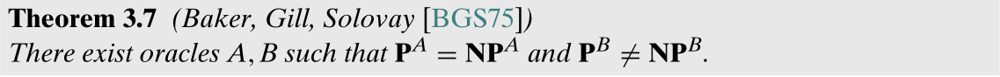

也即使用对角化不能证明 $\bf P=NP$ 的真假性。

> 一般来说，预言机是一个有用的算法抽象，使用另一个函数作为黑盒子例程，而不关心它是如何实现的。

### 3.4.1 逻辑独立性与相对性

相对化的概念受到数学逻辑中独立性结果的启发，这表明某些自然的数学陈述在特定的公理系统中不能被证明或否定。因为相对化结果表明，使用“已知技术”既不能证明也不能否定 $\bf P=NP$ 的陈述，所以它们也可以被视为独立性结果。然而，他们并不像连续统假设的结果那样严谨，因为“已知技术”的概念是模糊的。

# 4 - 空间复杂性

本章研究计算任务的*内存需求*，定义*空间有界计算*，限制了图灵机在计算时可以使用的纸带单元个数。

类似 $\bf NP$ 问题，定义了空间有界类的*完全*问题；对于多项式空间边界，完全问题包括在信息完全的双人游戏中寻找获胜策略。目前的理解是，计算这样的策略与解决像 SAT 这样的 NP 问题有着本质的不同(可能比它更难)。

**非线性空间的计算（computations that run in *sublinear* space）**，即输入比算法的工作空间更大。

## 4.1 空间有界的定义

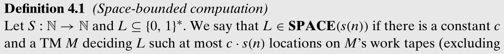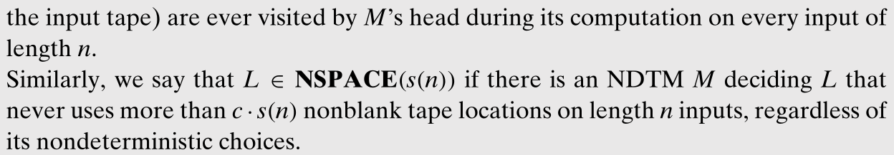

> NDTM 要求所有的序列都在 t(n) 时间内完成，才能说是 runs in t(n)；和 NDTM 类似，NSPACE 也要求所有的序列使用的工作纸带的空间都小于 s(n)。

*空间可构造（space-constructible）*，给定输入 $x$，存在一个图灵机可以在 $O(S(|x|))$ 空间内计算 $S(|x|)$。这是一个非常温和的限制，因为所有感兴趣的函数，包括 ${\rm log}n$，$n$ 和 $2^n$，都是空间可构造的。

由于TM的工作带与其输入带是分开的，所以考虑使用空间小于输入长度的空间受限机器是有意义的，即 $S(n)<n$。但仍需 $S(n)>{\rm log}n$，因为我们希望它能够至少“记住”正在读取的输入带单元的索引。

${\bf DTIME}(S(n))\sube{\bf SPACE}(S(n))$，因为一个图灵机一步只能访问一个纸带单元，而一个 ${\bf SPACE}(S(n))$ 图灵机可以运行远超 $S(n)$ 步，并且空间可以被重用。又有：

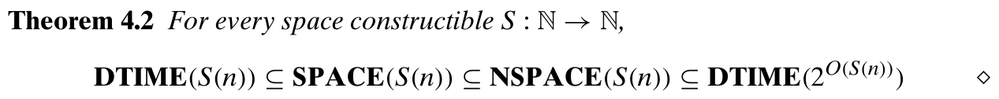

多项式的空间状态可以被指数时间枚举。而对于 ${\bf SPACE}(S(n))\sube{\bf NSPACE}(S(n))$，因为非确定性，$\bf NSPACE$ 的空间利用率更高，可以解决更多的问题，但仍然可以被指数型时间枚举。

### 4.1.1 配置图（Configuration graphs）

可以看作是图灵机状态的转移图。

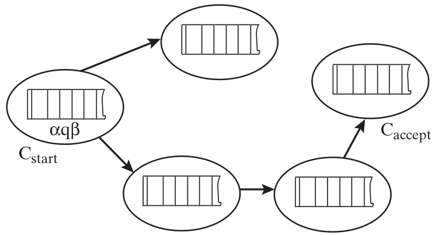

### 4.1.2 一些空间复杂类

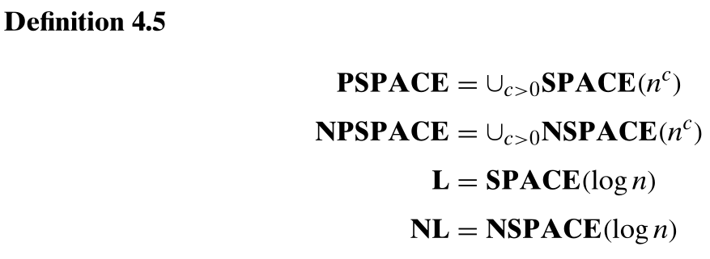

尽管只使用 $O({\rm log}n)$ 空间除了的基本算数外，似乎很难还有什么复杂的计算，但现在还不能排除 ${\rm 3SAT}\in{\bf L}$；换句话说，$\bf NP\neq L$ 是个尚待解决的问题。

### 4.1.3 空间层次定理

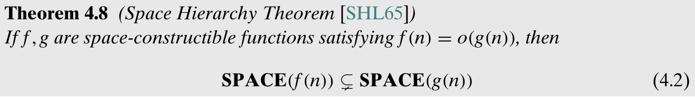

> 多使用了空间一定能够解决更多的问题，因为时间没有限制。

## 4.2 $\bf PSPACE$ 完全性

目前并不知道是否 $\bf P=PSPACE$，尽管我们相信答案是否定的。因为 $\bf NP\sube PSPACE$，所以 $\bf P=PSPACE$ 意味着 $\bf P=NP$。类似 NP-完全问题，可以定义 PSPACE-难和 PSPACE=完全：

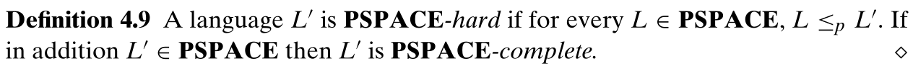

**一个 PSPACE-完全问题**

定义 QBF：

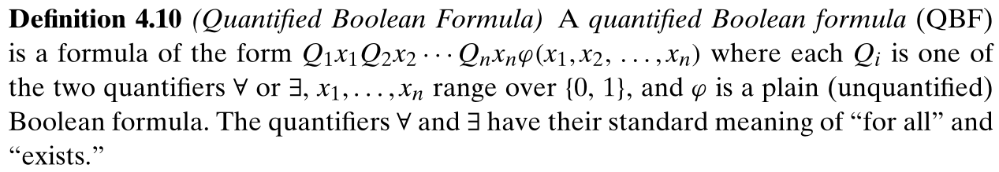

即在布尔公式前加上了若干量词，同时该定义限制了 QBF 为前束范式（量词出现在左边）。而所有的 QBF 都可以在多项式时间内转化为等价的前束范式。非量化公式是否为 CNF/3CNF 同样不重要，因为可以在多项式时间内转换一个一般 QBF 到一个内部公式是 CNF 形式的等价公式。

定义语言 TQBF 是所有为真的量化布尔公式的集合，则 TQBF 是 PSPACE-完全问题。

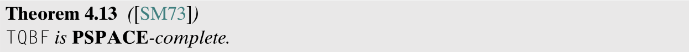

### 4.2.1 Savitch 定理

TQBF 不仅是 PSPACE-难问题，同样是 NPSPACE-难问题，因为 ${\rm TQBF}\in{\bf PSPACE}$，所以 $\bf PSPACE=NPSPACE$，与 4.1 相契合。

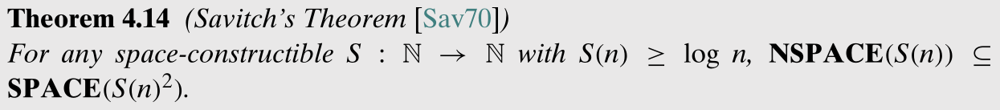

### 4.2.2 $\bf PSPACE$ 的本质：玩游戏的最佳策略

NP-完全问题的核心特征是一个肯定的答案有一个简短的证明。PSPACE-完全问题的类似概念似乎是一个有完美信息的两人游戏的获胜策略，如 QBF 游戏：

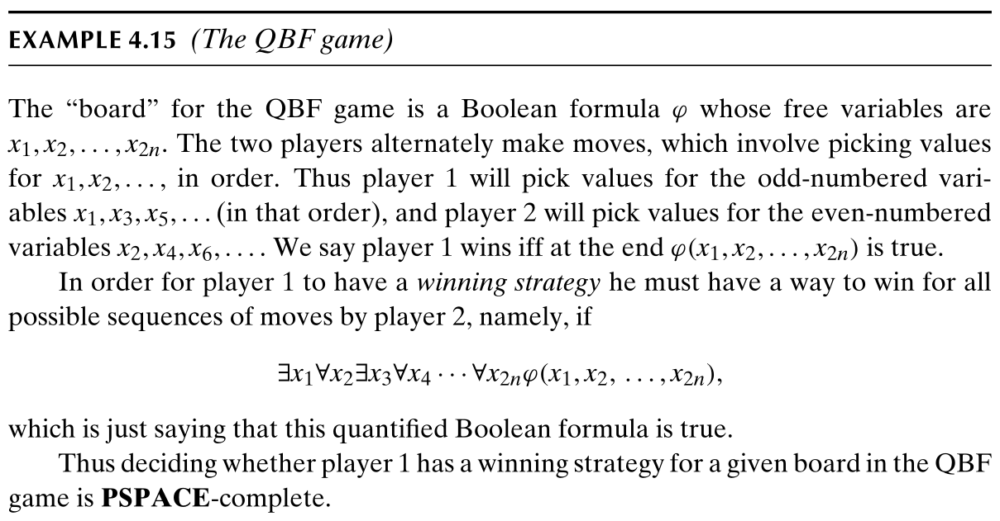

（找到一条必胜路径就是 PSPACE-问题的本质吗？）

如果 $\bf NP\neq PSPACE$，那么就没有简短的证书来证明这种游戏中的任何一个玩家都有获胜的策略。

## 4.3 $\bf NL$ 完全性

对于 $\bf NL$ 类，不能简单地使用 $\le_p$，因为 $\bf L\sube NL\sube P$，规约不能比较弱的类（$\bf L$）更强。替代地使用*对数空间*规约，也即使用一个运行在对数空间上的确定图灵机来计算。一个对数空间图灵机可能没有足够的内存写出输出结果，因此规约需要能够在对数空间内计算输出的任意位，即在输入 $<x,i>$ 上输出 $f(x)_i$，其中 $i\le|f(x)|$。

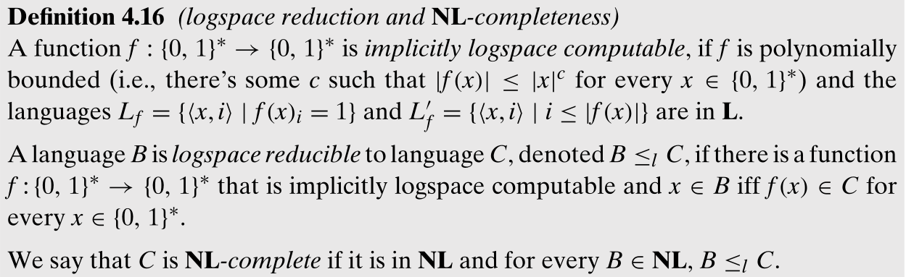

> *隐式对数空间可计算（implicitly logspace computable）*，即满足 $f$ 是多项式有界的（即 $f$ 的输出是关于 $x$ 多项式长度的）以及计算输出的每一位都只需要对数空间。可以看作是输出只能写一次，因此可以看作输出不占用存储空间。

一个 NL-完全语言属于 $\bf L$ 当且仅当 $\bf NL=L$。以及：

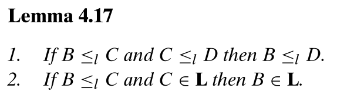

PATH 问题（语言）（三元组 $<G,s,t>$ 的集合，在每个集合中，顶点 $t$ 可以在有向图 $G$ 中由 $s$ 到达）是 NL-完全的。

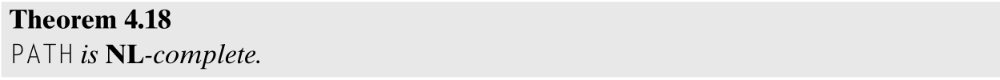

### 4.3.1 $\bf NL$ 的 Certificate 定义：只读一次的证明

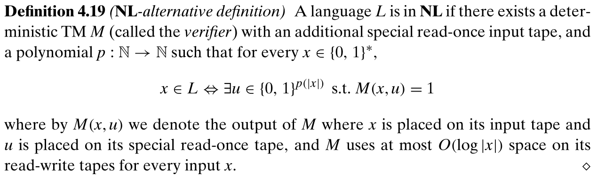

> - 若来回可读且多次，则等价于一块空间，因此需要限制；
> - 若移除只读一次的限制，则由 $\bf NL$ 转换为 $\bf NP$ 问题。

### 4.3.2 $\bf NL=coNL$

同样的有：

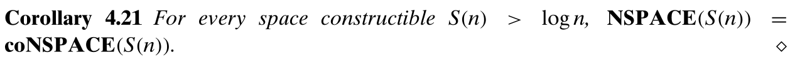

需要注意的是，$\bf coNL$ 类似 $\bf coNP$，并非是 $\bf NL$ 的补集，而是由 $\bf NL$ 语言的补充语言组成的集合。

可以得到空间有界和时间有界复杂类之间的关系：

$\bf L\sube NL\sube P\sube NP\sube PSPACE\sube EXP$