**疑问**

1. P100, Claim 5.9, $\Sigma^p_i$ 中的 $u\in\{0,1\}^{q(|x|)}$，因此它中出现的 $\forall$ 可以一次遍历 $2^{q(|x|)}$，而 $\Sigma_i{\bf TIME}(n^c)$ 中 $i/2$ 次的 $\forall$ 只有两种选择，可以直接相等吗？
2. P108, 第一段中第二句，"Note also that the Boolean formulas studied in earlier chapters are circuits where the fan-out (i.e., number of outgoing ed ges) of each vertex is 1"，我理解出度为 1 的话，说明每个变量只使用一次，回顾应该是没有这个限制的？
3. P115，6.5 前，说 "Thus upper bounds (in this case, NP⊆P) can potentially be use dto prove circuit lower bounds"，是什么意思？
4. P119, Definition 6.28, 为什么是对数空间规约而非多项式时间规约？我理解多项式时间即可，尽管对数时间规约属于 P 类。

# 5 - 多项式层级和交替图灵机

> Polynomial Hierarchy and Alternating TM

捕获了无法只用非确定性捕获的问题的复杂类是多项式层级，记为 $\bf PH$，是 $\bf P$，$\bf NP$ 以及 $\bf coNP$ 的一般化（generalization）。包括无限数量的子类（称为层级）。这些子类被猜想是不同的，并且这个猜想是 $\bf P\neq NP$ 的更强形式。

## 5.1 类 ${\bf\Sigma}_2^p$

存在似乎不能被 $\bf NP$-完全捕获的计算问题。

对于 $\bf NP$ 问题 INDSET，每个成员都有一个简短的证明（独立集需要枚举，但有一个存在即可，即短证明）：

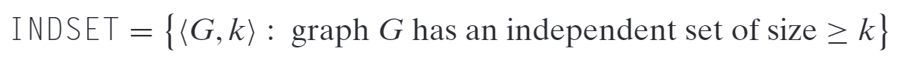

修改这个问题成确定一个图中的最大独立集：

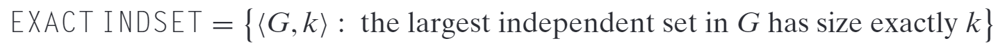

问题 EXACT INDSET 似乎不存在短证明，因为需要所有的独立集都求出来才可以。

问题 MIN-EQ-DNF，确定等价于给定公式的最小布尔公式：

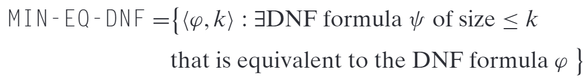

问题 MIN-EQ-DNF 也没有明显的短证明，因为等价性需要枚举所有的赋值，后边的 equivalent 隐含着 $\forall$。

对于 EXACT INDSET 和 MIN-EQ-DNF 这样的问题，需要存在量词（$\bf NP$）和全称量词（$\bf coNP$）的组合，定义为类 ${\bf\Sigma}_2^p$：

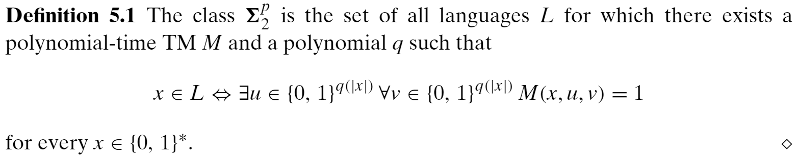

> ${\bf\Sigma}_2^p$ 包含（但不限于）类 $\bf NP$ 和 $\bf coNP$；
>
> MIN-EQ-DNF 是 ${\bf\Sigma}_2^p$-完全问题。

## 5.2 多项式层级

$\bf PH$ 一般化 $\bf NP$，$\bf coNP$ 以及 ${\bf\Sigma}_2^p$。这个类包含每个可以由一个多项式时间计算的谓词和常数多个 $\forall/\exist$ 量词组合定义的语言：

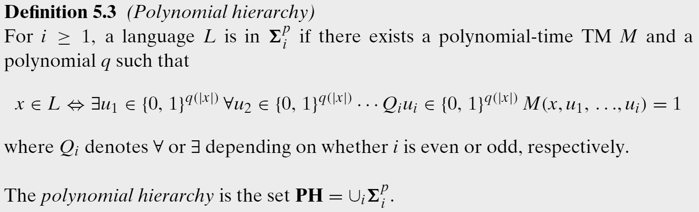

有 ${\bf\Sigma}_1^p={\bf NP}$。定义 ${\bf\Pi}_i^p={\bf co\Sigma}_i^p=\{\overline{L}:L\in{\bf\Sigma}_i^p\}$。因此 ${{\bf\Pi}_i^p={\bf coNP}}$。并且有 ${\bf\Sigma}_2^p\sube{\bf\Pi}_{i+1}^p\sube{\bf\Sigma}_{i+2}^p$，因此${\bf PH}=\cup_{i>0}{\bf\Pi}_i^p$。

### 5.2.1 $\bf PH$ 的性质

我们相信 $\bf P\neq NP$ 以及 $\bf NP\neq coNP$，而这些猜想的一般化为 ${{\bf\Sigma}_i^p}$ 严格包含于 ${{\bf\Sigma}_{i+1}^p}$。表述为“PH 永不塌缩！”，其中如果存在 $i$ 使得 ${{\bf\Sigma}_i^p}={{\bf\Sigma}_{i+1}^p}$，则称 PH 塌缩，同时隐含 ${{\bf\Sigma}_i^p}={\cup}_{j\ge1}{{\bf\Sigma}_j^p}={\bf PH}$，这时可以说 PH 塌缩至第 $i$ 层。

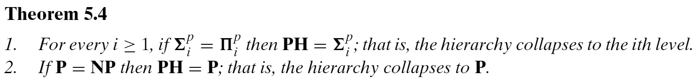

### 5.2.2 PH 不同层的完全问题

对每个 $i\in\mathbb{N}$，${{\bf\Sigma}_i^p}$ 和 ${{\bf\Pi}_i^p}$ 都有完全问题，而 PH 本身被认为没有完全问题（除非 PH 塌缩）。

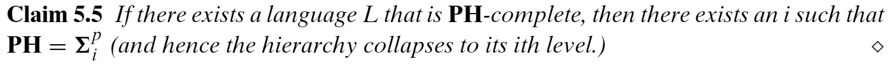

显然如 $\bf NP$ 和 $\bf coNP$ 一样，$\bf PH$ 也包含与 $\bf PSPACE$，除非 PH 塌缩，否则 $\bf PH\neq PSPACE$。

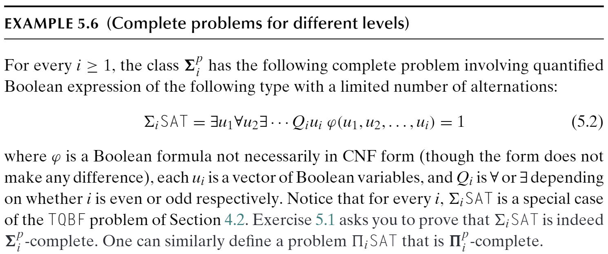

需要注意的是，其中每个 $u_i$ 表示一组布尔变量。

## 5.3 交替图灵机

ATM 是非确定图灵机的一般化。NDTM 不是一个现实的计算模型，但它有助于我们关注猜一个答案和验证它的区别。ATM 在没有明显的短证明的问题中起到类似的作用。

ATM 类似 NDTM，但其内部状态（除了接受和终止状态）会被 $\exist$ 或者 $\forall$ 标记。NDTM 接受输入当存在一条到达接受状态的路径时，可以看作每个内部状态都标记为 $\exist$，在 ATM 中，则可以在 $\exist$ 和 $\forall$ 之间交替选择。

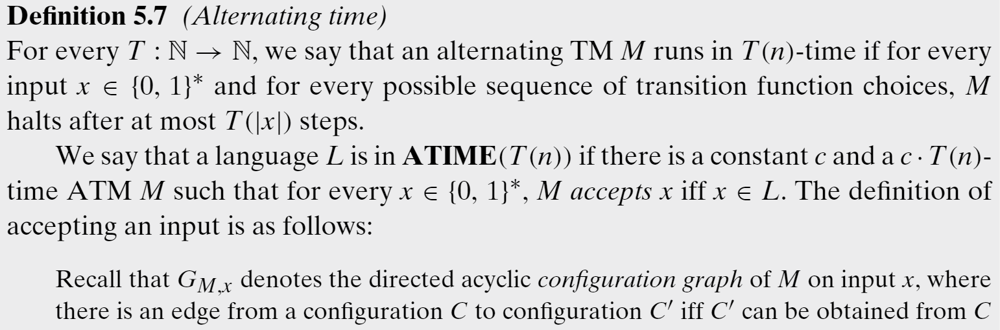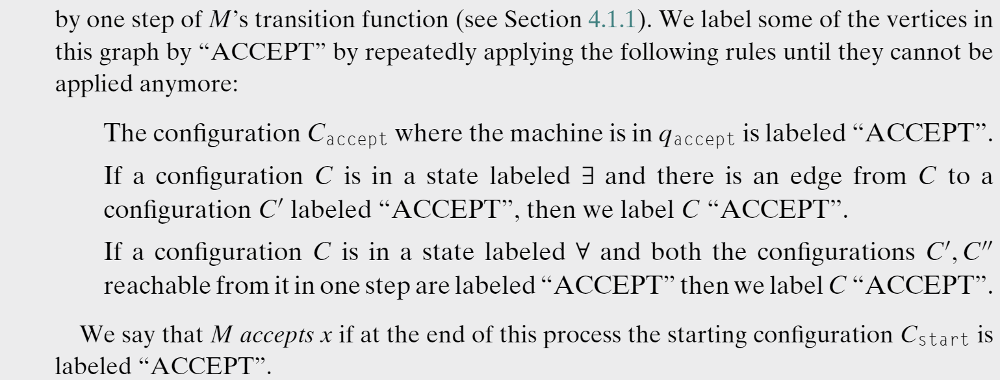

判断输入是否可以被接受可以通过由接受状态向前传播的算法。

类似地还可以定义每层的时间类：

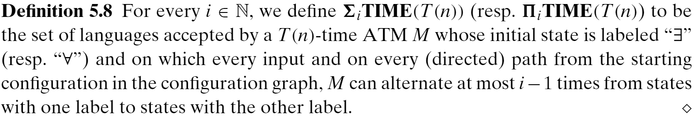

则有：

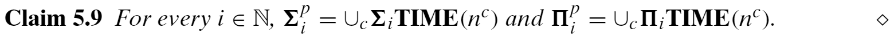

### 5.3.1 无限制的交替

PH 限制 ATM 中交替的个数取决于输入的大小，在移除这一限制后可以得到问题 ${\bf AP}=\cup_c{\bf ATIME}(n^c)$，则有定理：

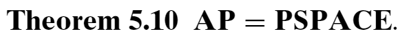

对于左边包含右边，可以由 TQBF（PSPACE-完全）在 AP 中证明（只需要使用对应的量词即可）；对于右边包含左变，使用类似 TQBF 属于 PSPACE 的证明方法，判断一个布尔等式为真使用多项式空间，所有情况的遍历只需要递归地判断所有的布尔等式即可。

类似地可以定义运行在多项式空间内的 ATM，这类语言的集合称为 $\bf APSPACE$。有 $\bf APSPACE=EXP$，类似地有可被交替对数空间 TM 接受的语言集合等价于 $\bf P$。对于 $\bf APSPACE=EXP$，右边包含左边，因为 APS 相当于对指数个 0/1 求 and/or 操作的值，可在指数时间内结局；而左边包含右边，因为 EXP 最多有指数状态，多项式空间即可编码，而 ATM 可以通过量词枚举所有的状态。

## 5.4 时间与交替：SAT 的时间-空间权衡

尽管 SAT 被认为需要指数时间和线性空间，但目前尚未证明。事实上，SAT 可能同时有线性算法和对数空间算法。但我们可以排除最 trivial 的算法：一个运行在渐近线性时间和对数空间的算法：

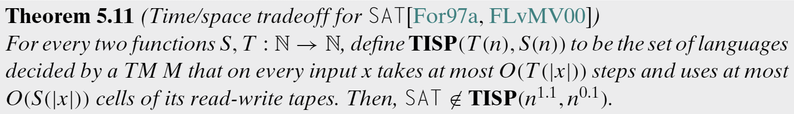

也即，我们可以排除 SAT 在时间和空间上同时最优的可能。

## 5.5 通过预言机定义层级

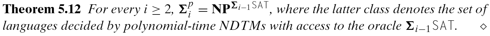

需要注意的是，尽管尚未证明 $\overline{\rm SAT}\in{\bf NP}$，但能够预言 SAT 的预言机可以单步判断 SAT 的成员，因此这一能力也包括了解决 $\bf coNP$ 问题，类似的，${\bf\Sigma}_i^p$ 是能够在解决 ${\bf\Sigma}_{i-1}^p$ 和 ${\bf co\Sigma}_{i-1}^p$ 的基础上（作为单位）的 $\bf NP$ 问题。

而因为完全问题可以解决该类所有问题，因此可以用该类名替代对应的问题，比如表示 ${\bf\Sigma}_3^p$ 为 $\bf NP^{NP^{NP}}$。

# 6 布尔电路

布尔电路是一个计算模型，是布尔公式的泛化和用于制造现代计算机的硅芯片的简化模型。布尔电路是一个刻画非一致计算的自然模型。

一致（uniform）计算：同一个图灵机用于所有所有的无限多的输入大小上，即对不同的输入使用相同的算法。

非一致（nonuniform）计算：对每个输入大小，允许使用不同的算法。

可能存在小并且高效的特制硅芯片，能够解决每个 3SAT 问题，即使 $\bf P\neq NP$，这样的芯片的存在依然不能排除。本章将给出证据表明这样的芯片不太可能存在，至少随着 3CNF 中变量的数量开始变大的时候。

## 6.1 布尔电路和 $\bf P_{/POLY}$

一个布尔电路是一个程序图，表明如何通过在输入比特上基础的布尔运算（与或非）由一个二进制输入串推导一个输出。为了方便，假设电路只产生一个比特的输出。

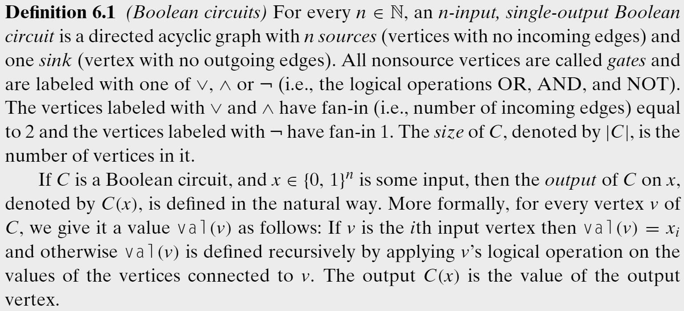

尽管定义限制了入度为 2，但多入度可以由多个入度为 2 的门模拟。

这种定义的动机是对现代计算机中使用的硅芯片进行建模。因此，如果我们证明某个任务可以通过一个小的布尔电路来解决，那么它就可以在硅芯片上高效地实现。

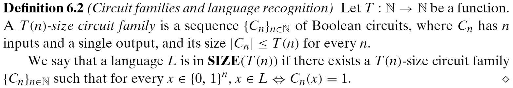

因为 CNF 公式是电路的特殊形式，因此由 Claim 2.13 可以得到，每个由 $\{0,1\}^n$ 到 ${0,1}$ 的函数 $f$ 都可以由一个大小为 $n2^n$ 的布尔电路计算，但事实上，大小 $O(2^n/n)$ 足矣。考虑何为“小的电路”，可以定义：

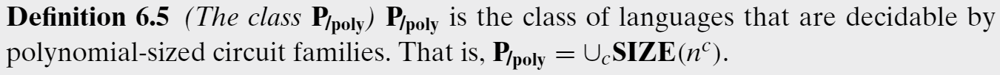

尽管多项式的次可能会很大，但是我们希望能够证明像 SAT 这样的语言不在 $\bf P_{/POLY}$ 中，当次尽可能大依然不能判定 SAT 语言时，这样的表述就会更强。

**直线型程序**，除了建模布尔运算为标签图，同样可以建模为一个直线型程序（不包含分支和循环操作）。显然一个在 $n$ 位上的函数 $f$ 可以由一个 $S$-行的直线型程序计算，当且仅当可以被 S 大小的布尔电路计算时。

### 6.1.1 $\bf P_{/POLY}$ 和 $\bf P$ 的关系

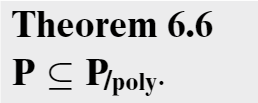

转移可以用电路表示，每一步都可以由多项式的电路完成，总共多项式步，组合可以得到一个仍为多项式大小的电路，根据输入计算最后的结果是否为 1。

电路不仅可以是多项式大小的，还可以在多项式时间内计算，甚至在对数空间内计算（这里的空间与电路大小不同，我理解是可以用图灵机使用对数空间计算）。

P 是 P/poly 的真子集，因为存在不可判定的一进制语言不属于 P，然而每个一进制语言都属于 P/poly。

比如停机问题的一进制版本：

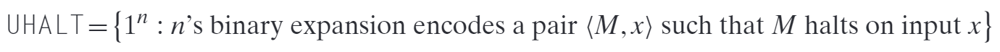

因为 TM 是通用的，而 n 是无限的，所以需要计算 n 表示的输入是否停机；而对于布尔电路，每个 n 对应是否停机都是确定的，单独设计电路即可。

### 6.1.2 电路可满足性

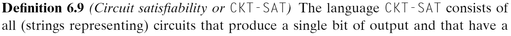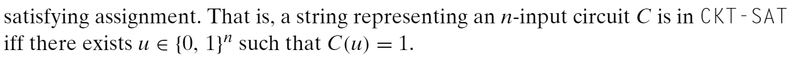

CKT-SAT 显然是 NP 的。可以得到两个引理：

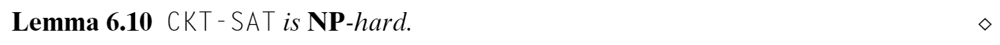

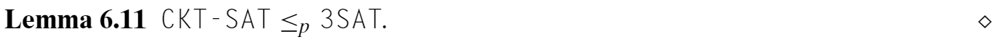

## 6.2 一致生成的电路

类 P/poly 在复杂性世界中相当尴尬，因为它包含甚至无法确定的语言。问题的根本在于对于 P/poly 中的语言 L，满足存在可判定 L 的电路族即可，即使我们不知道构建这样的电路的方法。因此，尝试将注意力集中在可以实际构建的电路上（例如使用相当高效的图灵机）可能是有用的。

定义可由一个图灵机根据输入大小，在多项式时间内生成电路的电路族，即 P-一致电路族：

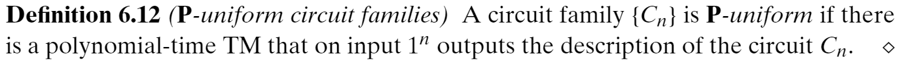

P-一致的限制使得 P/poly 塌缩到了类 P。

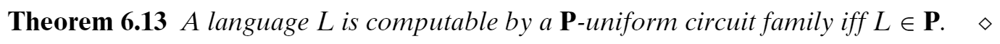

### 6.2.1 对数空间一致族

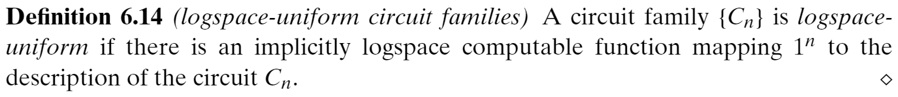

因为对数空间的计算在多项式时间内进行，因此对数空间一致电路也是 P-一致的。表示一个大小为 S 的电路，可以用 S * S 的邻接矩阵和一个元素为节点标签的长度为 S 的数组表示。使用 [S] 中的数字标记每个顶点。一个电路族 $\{C_n\}$ 是对数空间一致的当且仅当以下函数可以在对数空间内计算：

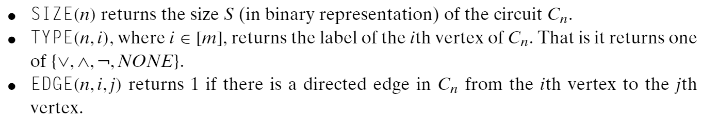

对数空间一致同样使 P/poly 塌缩到了 P：

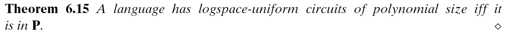

## 6.3 接受建议的图灵机

可以使用接受建议的图灵机定义 P/poly。

接受建议的图灵机，对每个 $n$，都有一个可以在输入大小为 $n$ 时，在计算中可用的建议字符串 $\alpha_n$。

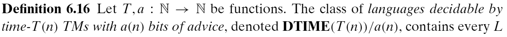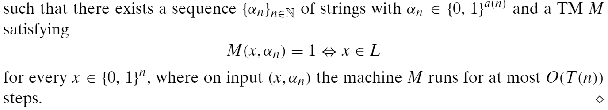

比如对于 UHALT，对每个长度为 n 的输入，建议为 1 比特，表示输入是否为该语言的成员。

可以定义 P/poly：

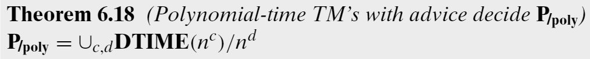

## 6.4 $\bf P_{/POLY}$ 和 $\bf NP$

如果 PH 不塌缩，则 SAT 不在 P/poly 中：

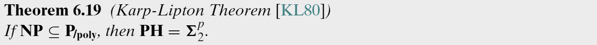

类似地，P/poly 也不太可能包括 EXP：

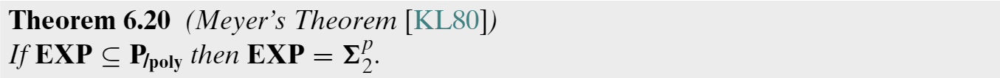

Theorem 6.20 隐含着，如果 P = NP，则 EXP 不包含于 P/poly。因为如果 P = NP，则 P = $\Sigma_2^p$，若 EXP 包含于 P/poly，则 P = EXP，与时间分层定理矛盾。

"上界可潜在地用于证明电路下界"，不知道是什么意思。

## 6.5 电路下界

因为 P 包含于 P/poly，所以如果我们证明了 NP 不包含于 P/poly，就可以证明 $\bf P\neq NP$。

可以证明存在函数需要非常大的电路来计算：

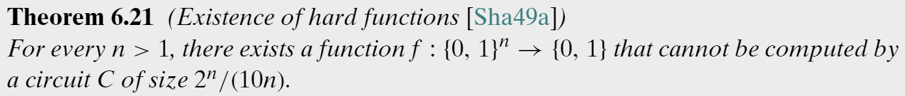

证明思路为枚举电路的个数，小于函数的可能个数。标题中的电路下界也即对于一个函数，至少需要多大的电路。

还有一种证明的思路是通过计算存在一个与函数相匹配的大小最多为 S 的电路的概率，而概率的值远小于一，因此存在一个函数使得不存在满足大小的电路来计算。这样的技术称为概率方法。

因此只要找到一个这样的函数是 NP 中的问题，并且不能被大于多项式大小的电路解决，就可以证明 NP 不包含与 P/poly，但是目前 NP 语言的最好的电路下界只有 (5 - o(1)) n。

> 我认为电路的下界之所以好计算，是因为电路的大小和运行时间都是由门的数量决定的，而图灵机本身允许循环等操作，所以不好计算下界。

## 6.6 非一致分层定理

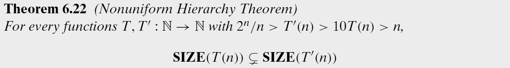

可使用的电路大小增加，可以解决的问题一定增加。我理解这里的 10 是因为 6.21 中困难函数中的下界导致的，超过这个下界的函数不确定是否仍然是真子集关系。

## 6.7 电路类中更精细的分级

介绍 P/poly 的一些子类，将与大规模并行计算机关联。

并行计算机可通过可互相发送信息的微处理器来解决问题，内部网络允许连接 n 个处理器，并使得内部通信可以在 O(log n) 步内完成。处理器在有锁的步（lock-step）内进行计算（比如全局时钟的 tick，并行计算通过全局时钟来保持同步），并且假设每一步只完成计算的一小部分，如在 O(log n) 比特上的运算。因此，每个处理器都有足够的内存来记住互连网络中自己的地址，并写下任何其他处理器的地址。

称一个计算问题有一个高效的并行算法，如果它可以被一个使用 $n^{O(1)}$ 个处理器，在 $log^{O(1)}n$ 时间内运行的并行计算机解决。

### 6.7.1 类 NC 和 AC

关联并行计算和电路。一个电路的深度指从一个输入节点到输出节点最长路径的长度。

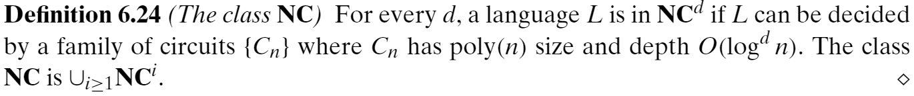

同样可以定义一致的 NC，通过限定电路是对数空间一致的。

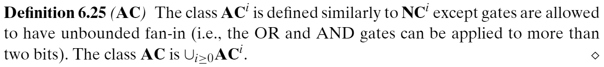

AC 和 NC 类似，但是不限制节点的入度。因为对于 poly(n) 个入度的与或门，可以用限制为 2 个入度的与或门，构造深度为 O(log n) 的子电路模拟。因此有：${\bf NC}^i\sube{\bf AC}^i\sube{\bf NC}^{i+1}$。

可以发现 NC 刻画了有高效并行算法的语言：

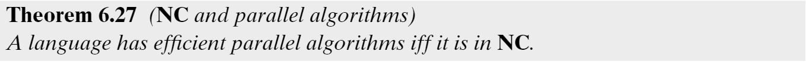

### 6.7.2 P-完全性

一个开放问题是是否每个多项式时间的算法都有一个高效的并行实现，或者说是否 $\bf P=NC$。这促使了 P-完全性理论，可以用来探究哪些问题可能是可高效并行化的以及哪些不能。

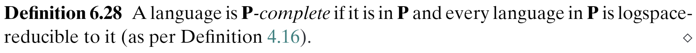

**疑问**，为什么用对数空间规约（尽管对数空间规约可在多项式时间内完成）。

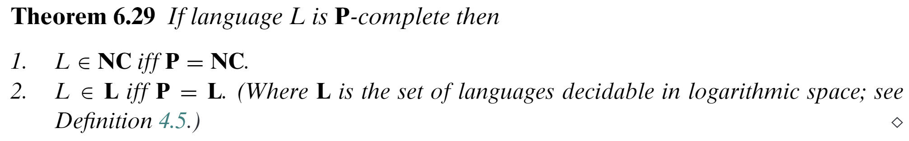

一个 P-完全语言：

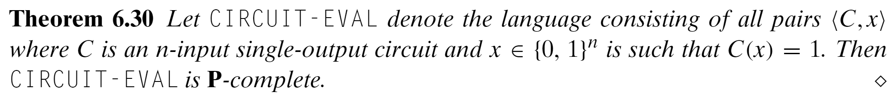

其他 P-语言都可以在对数空间内归约到 CIRCUIT-EVAL，因为对数空间一致，可以生成多项式电路，然后计算即可。

## 6.8 指数大小的电路

前边提到，对于任意语言，都有大小为 $O(2^n/n)$ 的电路可以解决。但实际中找到这样的电路可能非常困难（有时甚至不可判定）。类似指数空间一致族，将其中的隐式指数空间计算替换为多项式时间计算，得到的电路就可以达到指数大小，因为计算电路的每一位需要多项式时间，那么对多项式状态的枚举可以得到指数的大小的状态，每个对应电路的一位，可以达到指数大小。得到 DC-一致：

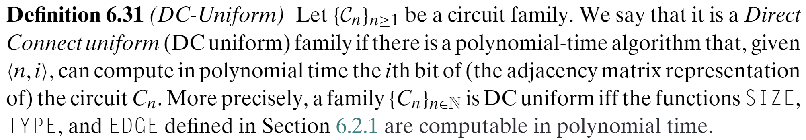

现在可以使用有限深度的一致的电路族来描述 PH 类：

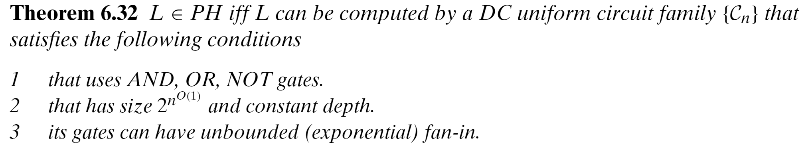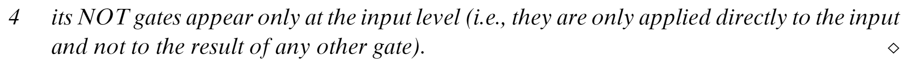

其中，我理解是前三条使得该类族可模拟 PH 问题中 $\forall$ 的选择，第四条使中间节点只能是 and/or，跟 PH 中的 $\forall$/$\exist$ 功能一致，而常数的深度和 PH 问题中不同的层次相对应。如果去掉常数深度的限制，则定义等价于 EXP。

