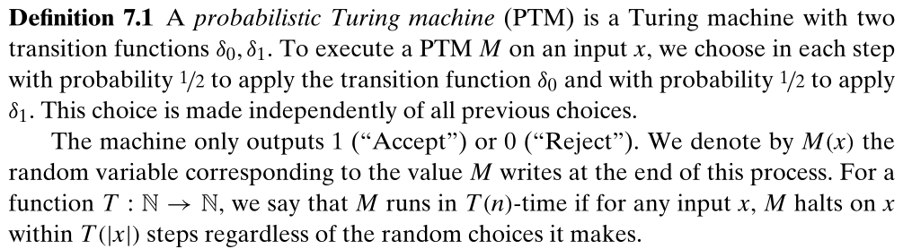
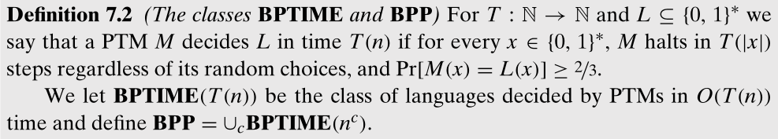
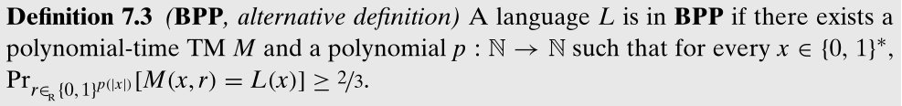

# 7 - 随机计算

之前使用图灵机作为计算的标准模型，但图灵机似乎没有在计算中进行随机选择的能力（大多数编程语言提供一个内建的随机数生成器，尽管通常是伪随机的）。值得考虑可以掷硬币的算法，即使用一个随机比特串的源。

经典统计中的民意测验等，尝试通过全体居民随机的小样本，来估计关于全体居民的事实。随机也是模拟现实世界系统的自然工具，这些系统本身就是概率性的。

本章不讨论随机数生成器的质量问题，而是关注能够随意掷硬币的图灵机的能力。

## 7.1 概率图灵机

随机算法是可能涉及随机选择（比如用从某个范围随机选择的整数初始化变量）的算法。实际上，随机算法是用随机数生成器实现的，而事实上，有一个能够生成随机比特串的随机数生成器就足够了，即以 $1/2$ 的概率生成 0，以 $1/2$ 的概率生成 1 的生成器。通常描述这样的生成器为掷公平硬币。

为了建模随机算法，使用概率图灵机：

需要注意，其中 PTM 的运行时间与进行的随机选择无关。

回顾 NDTM，同样是有两个转移函数的图灵机，因此 PTM 和 NDTM 是句法相似的（我理解是表示（对规则的描述）相似），区别在于如何解释图灵机的运行。NDTM 当存在输出 1 的路径时接受输入；而 PTM 考虑这种情况的分支的分数，也即 ${\rm Pr}[M(x)=1]$。概念上，PTM 更像 DTM 而非 NDTM，旨在模拟真实的计算设备。

使用类 ${\bf BPP}$ （bounded-error probabilistic polynomial-time）捕获高效的概率计算。对 $L\sube\{0,1\}^*$ 和 $x\in\{0,1\}^*$，定义 $L(x)=1$ 如果 $x\in L$，否则 $L(x)=0$。

其中常数 $2/3$ 被替换为任意大于 $1/2$ 的数都不会改变 BPTIME 和 BPP，还可以允许不公平的硬币投掷（即选择概率的概率不为 $1/2$），以及允许运行是期望的多项式时间。

根据 BPP 的定义，对于每个输入，M 输出正确结果的概率都需要至少为 $2/3$，因此 BPP 类似 P，仍然是捕获最坏情况下复杂性的类。而 DTM 是 PTM 的一个特殊情况，因此类 ${\bf BPP}$ 包含 ${\bf P}$。

类似 NP，也可以使用 DTM 定义 BPP，将掷硬币的过程作为一个额外输入：

显然 ${\bf BPP}\sube{\bf EXP}$，因为指数时间内可以枚举多项式时间 PTM 的所有可能的随机选择。当前研究者只知道 ${\bf BPP}$ 位于 ${\bf P}$ 和 ${\bf EXP}$ 之间，甚至不能证明 ${\bf BPP}$ 是不是 ${\bf NEXP}$ 的真子集。

一个核心的未决问题是，${\bf BPP}={\bf P}$ 是否成立，许多复杂性理论家相信 ${\bf BPP}={\bf P}$，也即存在转换每个概率算法到一个确定算法的方法，同时只导致多项式的减速。

## 7.2 一些 PTM 的例子

