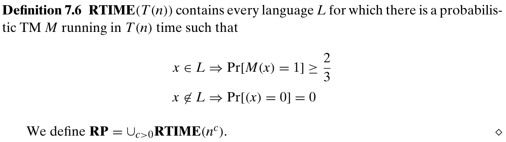
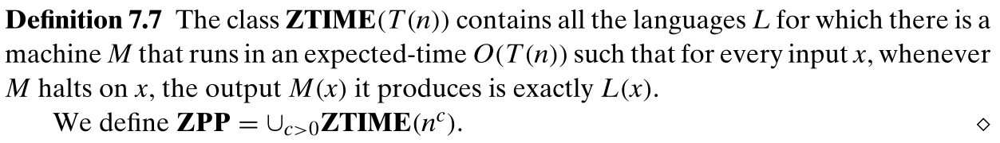
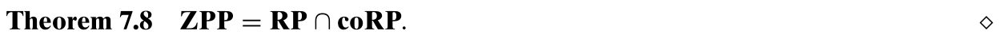
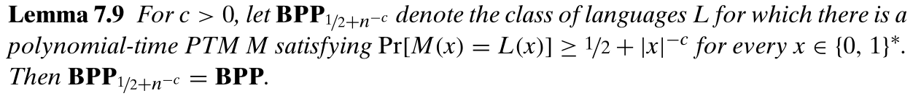
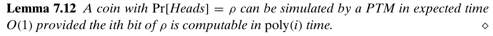
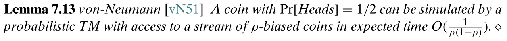
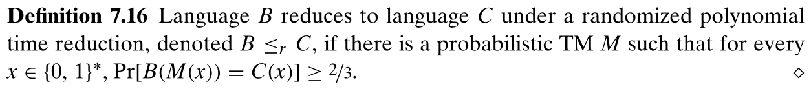
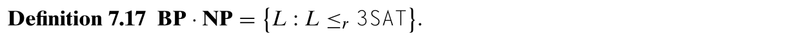
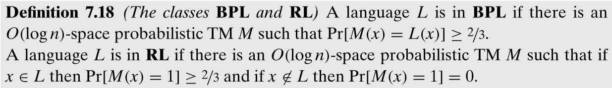

**疑问**

1. P130, 最后一段，为什么 $X$ 是**实**变量矩阵？下文中从 $[2n]$ 为 $x_{i,j}$ 选择值，难道 $[2n]$ 是实数集吗？是的话它的长度也是 $2n$ 吗？

# 7 - 随机计算

之前使用图灵机作为计算的标准模型，但图灵机似乎没有在计算中进行随机选择的能力（大多数编程语言提供一个内建的随机数生成器，尽管通常是伪随机的）。值得考虑可以掷硬币的算法，即使用一个随机比特串的源。

经典统计中的民意测验等，尝试通过全体居民随机的小样本，来估计关于全体居民的事实。随机也是模拟现实世界系统的自然工具，这些系统本身就是概率性的。

本章不讨论随机数生成器的质量问题，而是关注能够随意掷硬币的图灵机的能力。

## 7.1 概率图灵机

随机算法是可能涉及随机选择（比如用从某个范围随机选择的整数初始化变量）的算法。实际上，随机算法是用随机数生成器实现的，而事实上，有一个能够生成随机比特串的随机数生成器就足够了，即以 $1/2$ 的概率生成 0，以 $1/2$ 的概率生成 1 的生成器。通常描述这样的生成器为掷公平硬币。

为了建模随机算法，使用概率图灵机：

需要注意，其中 PTM 的运行时间与进行的随机选择无关。

回顾 NDTM，同样是有两个转移函数的图灵机，因此 PTM 和 NDTM 是句法相似的（我理解是表示（对规则的描述）相似），区别在于如何解释图灵机的运行。NDTM 当存在输出 1 的路径时接受输入；而 PTM 考虑这种情况的分支的分数，也即 ${\rm Pr}[M(x)=1]$。概念上，PTM 更像 DTM 而非 NDTM，旨在模拟真实的计算设备。

使用类 ${\bf BPP}$ （bounded-error probabilistic polynomial-time）捕获高效的概率计算。对 $L\sube\{0,1\}^*$ 和 $x\in\{0,1\}^*$，定义 $L(x)=1$ 如果 $x\in L$，否则 $L(x)=0$。

其中常数 $2/3$ 被替换为任意大于 $1/2$ 的数都不会改变 BPTIME 和 BPP，还可以允许不公平的硬币投掷（即选择概率的概率不为 $1/2$），以及允许运行是期望的多项式时间。

根据 BPP 的定义，对于每个输入，M 输出正确结果的概率都需要至少为 $2/3$，因此 BPP 类似 P，仍然是捕获最坏情况下复杂性的类。而 DTM 是 PTM 的一个特殊情况，因此类 ${\bf BPP}$ 包含 ${\bf P}$。

类似 NP，也可以使用 DTM 定义 BPP，将掷硬币的过程作为一个额外输入：

显然 ${\bf BPP}\sube{\bf EXP}$，因为指数时间内可以枚举多项式时间 PTM 的所有可能的随机选择。当前研究者只知道 ${\bf BPP}$ 位于 ${\bf P}$ 和 ${\bf EXP}$ 之间，甚至不能证明 ${\bf BPP}$ 是不是 ${\bf NEXP}$ 的真子集。

一个核心的未决问题是，${\bf BPP}={\bf P}$ 是否成立，许多复杂性理论家相信 ${\bf BPP}={\bf P}$，也即存在转换每个概率算法到一个确定算法的方法，同时只导致多项式的减速。

## 7.2 一些 PTM 的例子

> PTM 实例而非 BPP

### 7.2.1 查找中位数

查找第 $k$ 小的数：

时间复杂度是 $O(n)$ 的。

### 7.2.2 概率素数检测

素数检测即给定一个整数 $N$，判断它是否是素数。由素数组成的语言 PRIMES：

对任意数 $N$，以及 $A\in[N-1]$，定义

有以下事实：

可以得到算法：对于一个随机的 $1\le A<N$，如果 $gcd(N,A)>1$ 或 $(\frac{N}{A})\neq A^{(N-1)/2}$，则判断 $N$ 为合数；否则认为 $N$ 是素数。因为如果 $N$ 是素数，则一定满足 $gcd(N,A)=1$ 和 $(\frac{N}{A})=A^{(N-1)/2}$；而对于奇合数 $N$，当 $gcd(N,A)=1$ 时，仅有最多一半的 $A$ 能够令 $(\frac{N}{A})=A^{(N-1)/2}$，因此合数同时满足这两个条件的概率大于 $1/2$，而这个概率可以通过重复测试来放大。

### 7.2.3 多项式恒等检测

即给出一个以隐含形式定义的有整数系数的多项式，判定这个多项式是否恒等于零。

假设得到了代数电路形式（类似布尔电路，但运算为 $+,-,*$ 而非 $\and,\or,\neg$）的多项式，代数电路定义了一个由 $\mathbb{Z}^n$ 到 $\mathbb{Z}$ 的多项式，通过将输入放置在源节点上，并用对应的运算计算每个节点的值。定义 ZEROP 为计算恒等于零的多项式的代数电路的集合。判定 ZEROP 的成员也被称为多项式恒等检测，因为判断多项式 $C$ 和 $C'$ 是否恒等可以由 $D=C-C'$ 是否恒等于零完成。

而用于检验 ZEROP 成员的算法需要用到 Schwartz-Zippel Lemma：

该引理表明，由多项式的总次数 $d$ 和输入的取值集合的大小 $|S|$ 可以得到多项式的值不为零的概率下界，同时可以得到多项式取值为零的概率上届，即 $\cfrac{d}{|S|}$。以一元多项式为例，$d$ 次一元多项式最多 $d$ 个根，而 $x$ 从 $S$ 中选取，因此 $Pr[p(x)]=0\le\cfrac{d}{|S|}$。

一个大小为 $m$ 的电路 $C$ 可以包含最多 $m$ 个乘法，即定义一个次数最多为 $2^m$ 的多项式，比如：

因此可以得到一个简单的概率算法：从 1 到 $10*2^m$ 中选择 $n$ 个数 $x_1,...,x_n$，求电路 $C$ 在 $x_1,...,x_n$ 上的值 $y$，如果 $y=0$ 则接受，否则拒绝。显然如果 $C\in{\rm ZEROP}$，则总是接受。而如果 $C\notin{\rm ZEROP}$，至少有 $9/10$ 的概率会拒绝。因为 $d<2^m$，而 $|S|=10*2^m$，因此 $Pr(p\neq0)\ge\cfrac{9}{10}$。

但是这个算法存在一个问题，输出的大小可能为 $(10*2^m)^{2^m}$，即 $2^m$ 个 $10*2^m$ 相乘。可以通过一个称为指纹的技术解决这一问题，即在求值时模 $k$，$k$ 在 $[2^{2m}]$ 中随机选择，最后计算的值为 $y\ (mod\ k)$，显然如果 $y=0$，则 $y\ (mod\ k)$=0，而如果 $y\neq0$，则 $k$ 至少有 $\delta=\frac{1}{4m}$ 的概率不整除 $y$，这个概率足够了，因为可以通过重复这个过程 $O(1/\delta)$ 次，并且只有所有的输出都为 0 才接受（时间换空间）。

假设 $y\neq0$，令 $\mathcal{B}=\{p_1,...,p_{\mathcal{l}}\}$ 表示 $y$ 的不同的质因子，$k$ 是质数但不在 $\mathcal{B}$ 中的概率至少为 $\delta$。根据质数定理，对于足够大的 $m$，$[2^{2m}]$ 中的质数至少有 $\frac{2^{2m}}{2m}$ 个，因为 $y\le(10*2^m)^{2^m}$，因此 $y$ 至多有 ${\rm log}y\le5m2^m=o(\frac{2^{2m}}{2m})$ 个质因子，是 $\frac{2^{2m}}{2m}$ 的高阶无穷小，因此 $[2^{2m}]$ 中不在 $\mathcal{B}$ 中的质数至少有 $\frac{2^{2m}}{4m}$ 个，因此 $k$ 不能整除 $y$ 的概率至少有 $\delta=\frac{1}{4m}$。

### 7.2.4 二分图完备匹配检测

令 $G=(V,E)$ 是一个二分图，其中 $V$ 可以分成两个大小相同的不相交子集 $V_1,V_2$，即 $V=V_1\cup V_2$，并有 $E\sube V_1\times V_2$，即 $G$ 中的每一个边的两个顶点都分别属于 $V_1$ 和 $V_2$。$G$ 中的一个完备匹配是边的一个子集 $E'\sube E$ ，使得每个顶点在 $E'$ 中恰好出现一次。

记 $n=|V_1|=|V_2|$，用集合 $[n]$ 标识这两个集合，可以把 $E'$ 看作是一个排列 $\sigma:[n]\rightarrow[n]$，映射每个 $i\in[n]$ 到一个唯一的 $j\in[n]$，使得 $\overline{ij}\in E'$。令 $X$ 是一个 $n\times n$ 的实变量（？）矩阵，如果边 $\overline{ij}\in E$，则 $X_{i,j}$ 等于变量 $x_{i,j}$，否则 $X_{i,j}$ 等于 0。一个矩阵 $A$ 的行列式定义如下：

其中 $S_n$ 是 $[n]$ 所有排列的集合，$sgn(\sigma)$ 由 $\sigma$ 中逆序数的奇偶决定，当逆序数为偶数时为 $-1$，奇数时为 $+1$。因此 ${\rm det}(X)$ 是一个变量为 $\{x_{i,j}\}_{\overline{ij}\in E}$ $n$ 次多项式，并且对每个完备匹配都有一个对应的项。也即如果 $G$ 有完备匹配当且仅当 $det(X)$ 不是恒等于零的多项式。

由 Lemma 7.5，可以得到算法：从 $[2n]$ 中为 $x_{i,j}$ 选择值，在 $X$ 中替换并计算行列式，如果行列式非零，则判定输入的图有完备匹配，否则判定无。对于一个无完备匹配的图，结果一定为零；而对于一个存在完美匹配的图，结果不为零的概率大于等于 $1-\frac{n}{2n}=\frac{1}{2}$，因为多项式中次数最多为 $n$。

## 7.3 单边误差和“零边”误差：${\bf RP}$，${\bf coRP}$，${\bf ZPP}$

类 ${\bf BPP}$ 捕获了我们称为具有双边误差的概率算法。也即允许用于语言 $L$ 的算法在 $x\in L$ 时输出 0 以及在 $x\notin L$ 时输出 1。类似地，我们定义单边误差的概率算法，即当 $x\notin L$ 时，算法不会输出 1，但仍可能在 $x\in L$ 时输出 0。定义类 ${\bf RP}$ 捕获这样的算法：

注意，$\bf RP\sube NP$，因为 $M(x)=1$ 时，一定有 $x\in L$，接受的分支可以作为证明。相反的，我们并不知道是否 $\bf BPP\sube NP$。类 ${\bf coRP}=\{L|\overline{L}\in{\bf RP}\}$ 捕获了“另一方向”的单边误差算法，即当 $x\in L$ 时不会输出 0，而当 $x\notin L$ 时可能输出 1。

定义 PTM 的期望运行时间：对一个 PTM $M$ 以及输入 $x$，定义随机变量 $T_{M,x}$ 为 $M$ 在输入 $x$ 上的运行时间，也即 ${\rm Pr}[T_{M,x}=T]=p$ ，$M$ 在 $x$ 上 $T$ 步内停机的选择发生的概率是 $p$。如果对每个 $x\in\{0,1\}^*$ 期望 ${\rm E}[T_{M,x}]$ 最多为 $T(|x|)$，则称 $M$ 具有期望运行时间 $T(n)$。定义“零边”误差的类：

可以得到定理：

## 7.4 定义的稳健性

### 7.4.1 精确常数的作用：减少误差

常数 $2/3$ 可以由任何大于 $1/2$ 的常数代替：

显然 ${\bf BPP}\sube{\bf BPP}_{1/2+n^{-c}}$，因为前者对成功概率的要求下界大于后者。而任意一个成功率为 $1/2+n^{-c}$ 的机器都可以转换为一个成功率为 $2/3$ 甚至接近于 1 的机器：

通过若干次的重复，选择输出的主要结果作为输出，可以减小误差，提高结果的准确率。

### 7.4.2 期望运行时间和最坏情况运行时间

尽管在定义 RTIME 和 BPTIME 时，要求机器在 T(n) 时间内停机，而不管它的随机选择，但是可以使用期望运行时间代替。因为一个期望运行时间为 T(n) 的 PTM 可以变换为一个运行最多 100T(n) 步的 PTM，同时简单地增加一个计数器，在太多步之后以任意输出停止即可。而根据马尔可夫不等式，M 运行超过 100T(n) 步的概率最多为 1/100，因此这将使接受概率最多改变 1/100。

### 7.4.3 允许比公平随机硬币更一般的随机选择

对于出现头/尾概率是 $\rho$ 而非 1/2 的硬币，称之为 $\rho$-币。当 $\rho$ 是可高效计算的数时，概率算法的能力不会增加；但当 $\rho$ 不可高效计算时，$\rho$-币能够提供额外的计算能力：

方法是使用二进制小数表示 $\rho$，生成等长的值，当值小于 $\rho$ 就输出头，否则就输出尾。因为对于该长度的小数，生成每个值的概率都是相同的，而小于 $\rho$ 的概率为 $\rho$。

相反的，只能掷 $\rho$-币的概率算法的计算能力也不弱于标准概率算法：

即不同的概率可以相互模拟。

## 7.6 随机规约

类似之前的规约，定义两个语言之间的随机规约：

我的理解是规约转换成功的概率大于等于 $2/3$。随机规约不具有传递性，但如果 $C\in{\bf BPP}$ 及 $B\le_r C$，则 $B\in{\bf BPP}$，这里我认为是规约成功的概率大于等于 $2/3$ ，则解决 $C$ 的概率算法在应用规约之后，解决 $B$ 时依然能保持大于 $1/2$ 的正确率。

我们还可以用随机规约代替确定规约来定义 NP-完全性，因为 BPP 和 P 作为有效计算的形式概念是一样好的（因为 BPP 也是常数次的多项式计算，相对于 NP 而言都是高效的，所以也可以用来定义 NP-完全）。NP 可以定义为集合 $\{L:L\le_p{\rm 3SAT}\}$，替换为 $\le_r$ 可以得到：

## 7.7 空间有界的随机计算

类似空间有界的 DTM，可以定义空间有界的 PTM。称一个 PTM 使用 $S(n)$ 的空间，如果在任何计算分支中，使用的非空纸带最多为 $O(S(n))$。类 $\bf BPL$ 和 $\bf RL$ 是类 $\bf L$ 的双边误差和单边误差的概率类似版本：

可以发现 $\bf RL\sube NL$（因为 NDTM 只需要一条成功的路径即可，并且和 PTM 一样都是两个转移函数），因此 $\bf RL\sube P$。

一个 $\bf RL$-算法用于解决 UPATH 问题，UPATH 限制 PATH 问题到无向图，即给定一个 $n$ 个顶点的无向图，以及两个顶点 $s$ 和 $t$，判定 $s$ 和 $t$ 是否相连：

算法的过程为：从 $s$ 开始随机走长度为 $l=100n^4$ 的路径。也即初始化变量 $v$ 为 $s$，每一步随机选择 $v$ 的一个邻居 $u$，然后将 $u$ 赋值给 $v$。当且仅当在 $l$ 步内到达 $t$ 时接受。

算法仅需要对数空间，因为只需要存储顶点的编号。如果 $s$ 与 $t$ 不相连，显然算法不会接受；而如果 $s$ 和 $t$ 相连，则从 $s$ 走到 $t$ 的期望步数最多为 $10n^4$，因此接受的概率最少为 $3/4$。我猜这里是因为分布当期望为 $10n^4$ 时，大于 $100n^4$ 的值最多只占 $1/4$。