# 9 - 密码学

> Human ingenuity cannot concoct a cipher which human ingenuity cannot resolve.
>
> 人类的聪明才智无法炮制出人类聪明才智无法破解的密码。

现代密码学中，计算复杂性被用来争论加密方案的安全性。因为破译者的计算资源是有限的，因此为了确保安全性，人们应该努力确保破译问题在计算上是困难的。现代密码学中，加密的安全性不再依赖于保密的加密技术，加密技术本身是众所周知的；然而，它很难打破。只要潜在的计算问题确实很难解决，所有这些都被证明是安全的，可以抵御任何多项式时间的攻击，而不仅仅是我们今天所能想到的攻击。

## 9.1 完美保密和其局限

密码学的基本任务是加密。本节从较高的层次描述这项任务，并讨论它可能对加密的安全性意味着什么。

使用私有密钥的简单加密：

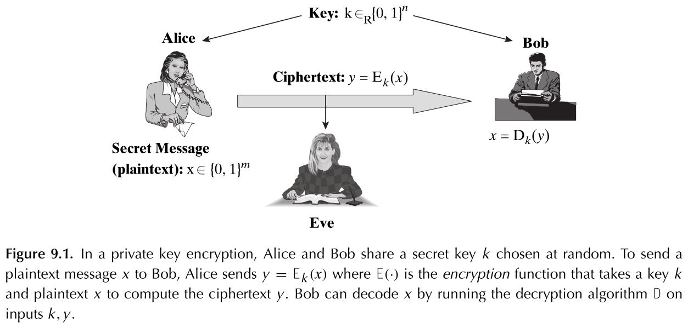

满足：

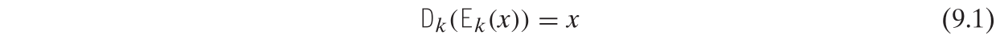

如果Eve不能从 $E_k(x)$ 计算 $x$，则方案是安全的，但这并不排除Eve计算x的某些部分信息的可能性。例如，如果Eve知道明文是消息“买”或“卖”，那么她只学习消息的第一个字符就足够了，即使她不能完全恢复它。香农给出了以下安全私钥加密的定义，以确保Eve不会从密文中得知任何关于明文的信息:

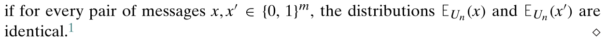

也即对于任意的两个明文，加密之后得到的密文的分布是一样的（加密可以是随机的），因此Eve绝对得不到关于明文的信息。

有一个非常简单的完全保密的加密方案，即一次性密码板。每次随机选择一个密钥 $k\in_R\{0,1\}^n$，加密 $x$ 为 $x\oplus k$，这样对于两个确定的明文，密文的整体分布与明文无关，只与密钥有关。

事实上，没有一个完全保密的加密方案可以使用比消息大小更短的密钥大小。

## 9.2 计算安全性、单向函数和伪随机生成器

尽管一次性密码板确实提供了完美的保密性，但它作为当今应用程序的实用解决方案完全失败，人们希望安全地交换兆字节甚至千兆字节的信息。完全保密需要和消息一样长的私钥，而且不清楚如此大的密钥能否安全交换。

实际上我们希望保持共享密钥相当小，比如几百位长。为了允许这一点，必须以某种方式放松完美的保密条件。主要思想将是设计仅对有效的窃听者安全的加密方案(即，在多项式时间内运行)。

然而如果 $\bf P=NP$，则小密钥大小也不能实现次完美的保密，因此假设 $\bf P\neq NP$ 将是任何进一步操作必须的。其实我们会依赖比 $\bf P\neq NP$ 更强的假设，即单向函数是存在的。

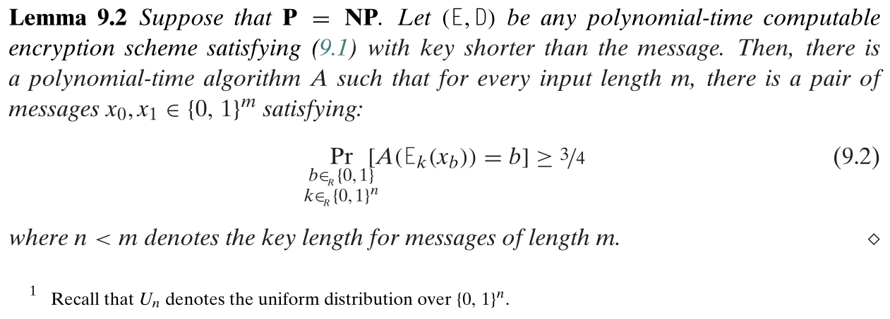

即如果 $\bf P=NP$，则存在多项式时间的破解算法。

可忽略的函数：

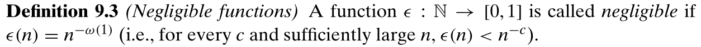

因为随着输入的增长，忽略不计的函数趋向于很快归零，所以在大多数实际和理论环境中，可以安全地忽略以忽略不计的概率发生的事件。

### 9.2.1 单向函数：定义和一些例子

单向函数——对于多项式时间算法来说，这个函数很容易计算，但很难求逆。

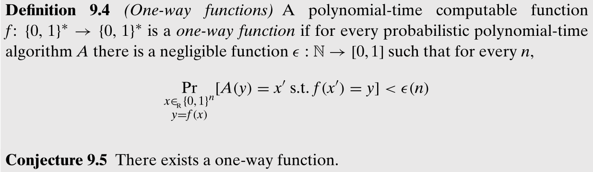

Conjecture 9.5 暗示 $\bf P\neq NP$。大多数研究人员认为猜想9.5是正确的，因为有几个函数还没有人能够反转：

1. *乘法，Multiplication*：将输入 $x\in\{0,1\}^n$ 看作是两个 $n/2$-比特的数 $A$ 和 $B$，输出 $A\times B$，反转这个函数被称为整数分解问题；
2. *RSA 和拉宾函数*；
3. *莱文通用单向函数*：存在一个函数 $f_{\mathcal{U}}$ 具有一个奇怪的性质：如果存在单向函数，一些单向函数 $f$，则 $f_{\mathcal{U}}$ 也是一个单向函数。$f_{\mathcal{U}}$ 定义为：将输入看作是一个列表 $x_1,..,x_{logn}$，每个元素长度为 $n/logn$ 比特，输出 $M_1^{n^2}(x_1),...,M_{logn}^{n^2}(x_n)$ 其中 $M_i$ 表示根据一些规范表示的第 $i$ 个图灵机，定义 $M^t(x)$ 为图灵机 $M$ 在输入 $x$ 上的输入，如果 $M$ 在 $x$ 上使用最多 $t$ 计算步。如果 $M$ 使用超过 $t$ 步，则 $M^t(x)$ 定义为全零的字符串 $0^{|x|}$。

### 9.2.2 单向函数加密

单向函数可以用来设计密钥比消息长度短得多的安全加密方案。

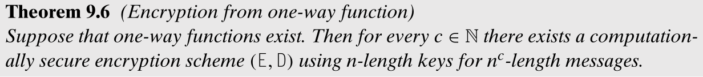

计算安全：安全加密不应该向多项式时间的窃听者透露关于明文的任何部分信息。为了演示，我们将使用一个更简单的宽松定义，即如果随机选择的明文的任何一个比特不能被窃听者猜到，并且概率不可忽略地高于1/2，则加密是“计算安全的”。则称一个加密方案 $(E,D)$，是用长度为 $n$ 的密钥加密长度为 $m$ 的信息是计算安全的如果对每个概率多项式时间 $A$，存在一个可忽略的函数 $\epsilon:\mathbb{N}\rightarrow[0,1]$ 使得

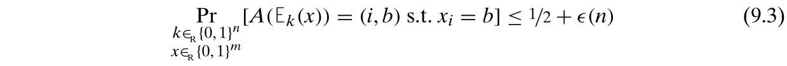

### 9.2.3 伪随机生成器

回想一下第 9.1 节的一次性密码板，其唯一的限制是需要一个共享的随机字符串，其长度等于所有需要传输的消息的组合长度。在定理 9.6 的证明中，主要的思想是展示如何获得一个长度为 length 的小随机密钥，它仍然是“足够随机的”，当它被用作一次性填充时，它提供了针对多项式时间窃听者的安全性。这种随机字符串的拉伸使用了一种称为伪随机生成器的工具，它的应用甚至超越了密码学。

我们没有像统计学家那样关注单个测试者算法，而是说分布必须“看起来”像每个多项式时间算法的均匀随机分布。这样的分布叫做伪随机。判别算法给出了一个从均匀分布或未知分布中抽取的样本串。该算法输出“1”或“0”，这取决于该字符串在它看来是否是随机的。如果多项式时间算法输出1的概率在两个分布上本质上相同，则该分布被称为伪随机，而不管使用哪种算法。

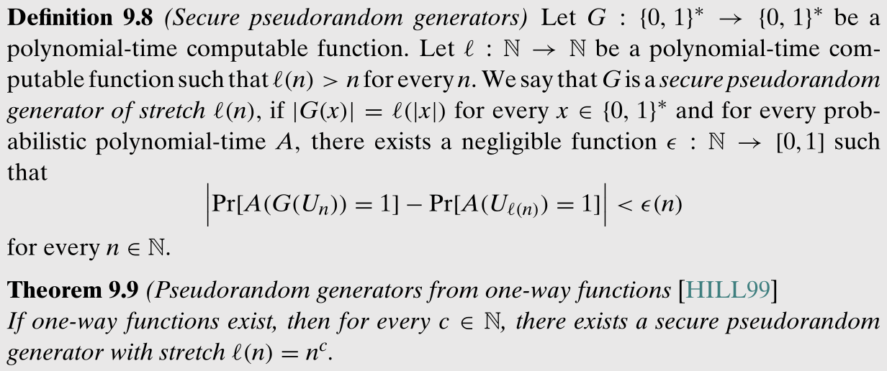

## 9.3 单项排列的伪随机生成器

当单向函数是一个排列时：

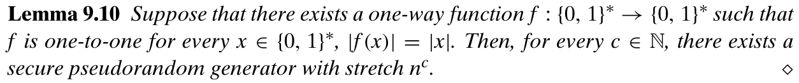

### 9.3.1 不可预知性隐涵伪随机性

这里的不可预知性是针对一个可计算的多项式时间函数，而非真随机。也即如果一个多项式时间函数的输出是不可预知的，则它具有伪随机性：

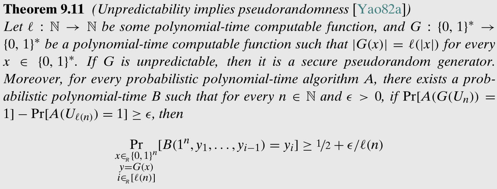

## 9.5 一些应用

### 9.5.1 伪随机函数及其应用

伪随机函数是伪随机发生器的自然推广。这当然让人想起伪随机发生器的定义，它的输出也必须通过一个“盲测”，而不是真正的随机字符串。这里的区别是，被谈论的对象是一个函数，它的真值表是指数大小的。

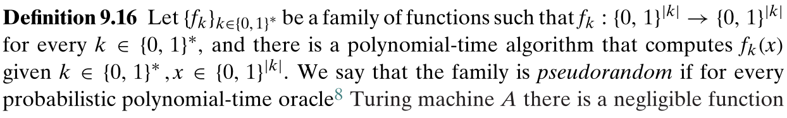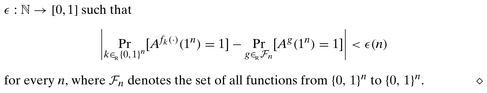

伪随机函数意味着任意多项式拉伸的安全伪随机发生器的存在。事实证明，反之亦然。

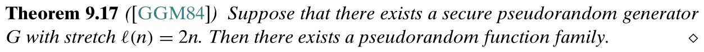

伪随机函数族可以被通信双方共享，然后一方在传输过程中只需要发送一串随机数即可。伪随机函数也用于消息认证码。

### 9.5.2 去随机化

伪随机发生器的存在意味着 BPP 的次指数确定性算法:这通常被称为 BPP 去随机化。也即对于 $L\in {\bf BPP}$，对于每个 $\epsilon>0$，存在一个 $2^{n^\epsilon}$-时间的确定算法 $A$ 使得对于每个样本分布，都有 

也即可以使用伪随机生成器来模拟真正的随机算法。

### 9.5.3 在电话里掷硬币

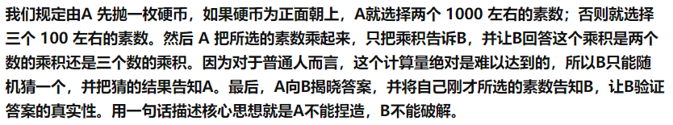

### 9.5.4 安全多方计算

k个人，他们希望计算他们的平均工资，而不互相透露他们的工资。在理想的环境中，他们只能将他们的输入发送到某个可信的机构，该机构根据这些输入计算 f 并广播结果。

### 9.5.5 机器学习的下界

伪随机函数的存在意味着，即使一个函数可能是多项式时间可计算的，也没有办法从多项式时间的例子中学习它。事实上，可以将这种不可能的结果扩展到更受限制的函数族。

# 11 - PCP 定理和近似困难：介绍

> PCP theorem and hardness of approximation: An introduction

**P**robabilistically Checkable **P**roofs。

一种观点是，PCP 定理提供了一种方法，可以将每个数学证明转换成一种形式，只需查看极少数(概率选择的)证明符号即可检查；另一个观点是，它是一个关于近似困难的结果，该定理表明，对于许多NP完全优化问题，计算近似解和计算精确解一样困难。

## 11.1 动机：NP-难优化问题的近似解

因为 $\bf P\neq NP$ 意味着成千上万的 NP-难优化问题没有有效的算法，于是注意力集中在它们是否有有效的近似算法上。在许多实际情况下，获得一个问题的近似解可能几乎和实际情况一样好，也可能容易得多。研究人员对寻找解决 NP-难优化问题的最佳近似算法非常感兴趣。例如，我们是否能以任意精度逼近有趣的 NP-问题：如果我们能，那么 $\bf P\neq NP$ 实际上不会是什么大问题。许多研究人员怀疑近似存在限制，证明这种限制是发现 PCP 定理的主要动机。

令 MAX-3SAT 是一个给定一个 3CNF 的布尔公式 $\phi$ 作为输入寻找一个最大化可满足的逻辑数的赋值的问题。这个问题当然是 NP-难的，因为相应的决策问题 3SAT 是 NP-完全的。我们以下面的方式定义了 MAX-3SAT 的近似算法：

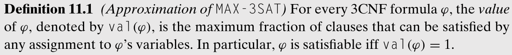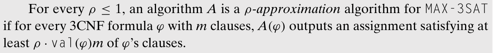

## 11.2 PCP 定理的两种观点

这个定理的一个观点是，它谈论新的、极其健壮的证明系统。另一个是逼近组合优化问题。

### 11.2.1 PCP 定理和局部可测试证明

假设有人想让你相信一个布尔公式是可满足的。他可以出示通常的证书，即一个令人满意的作业，然后你可以通过代入公式来检查。但是，这样做需要阅读整个证书。

PCP 定理展示了一个有趣的替代方案：这个人可以很容易地重写他的证书，这样你就可以通过概率选择一个恒定数量的位置（低至3位）来验证它。此外，这种概率验证具有以下特性：

(1) 正确的证书不会被拒绝；以及

(2) 如果公式不可满足，则保证会以高概率拒绝证书。

因为布尔可满足性是NP完全的，所以每一种其他的NP语言都可以被确定性地和有效地规约到它。

这种证明是一种“证明”形式的替代，它与通常的概念一样有效。然而，与标准的数学证明不同，在标准的数学证明中，每一行证明都必须被检查以验证其有效性，这一新概念通过只检查其中恒定数量的位来保证证明在概率上是可检查的。

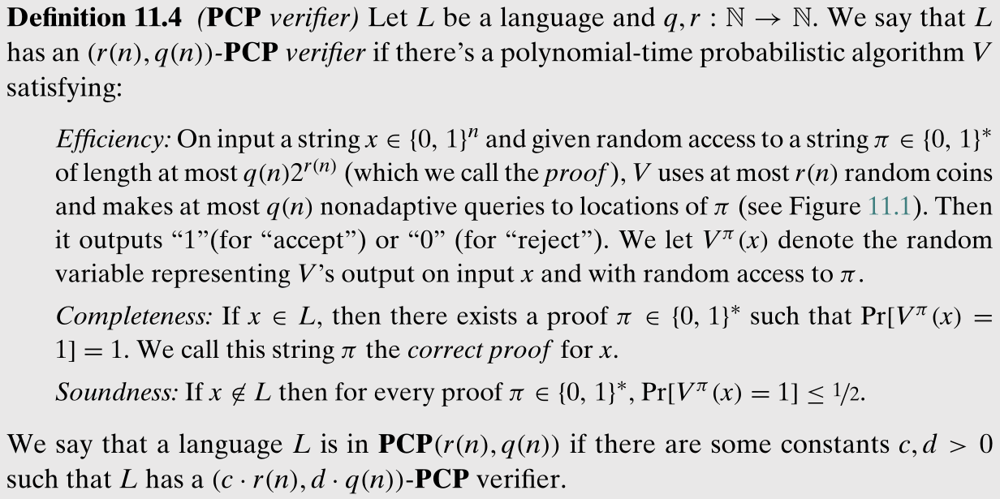

PCP 定理表明每种 NP 语言都有一个高效的 PCP 验证器：

还有定理：

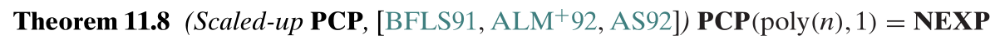

### 11.2.2 PCP 和近似困难

PCP 定理的另一个观点表明对于许多 NP-难优化问题，计算近似解并不比计算精确解容易。

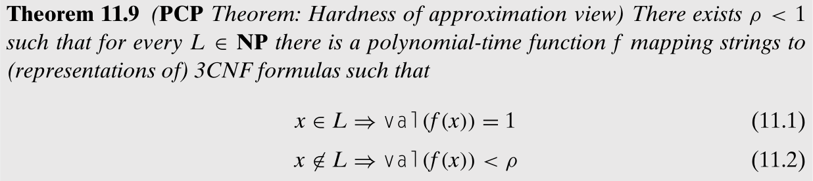

则可以得到推论：

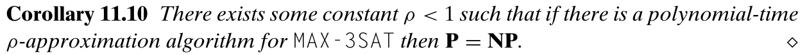

即若 MAX-3SAT 有一个多项式时间的 $\rho$-近似算法，则 $\bf P=NP$。

## 11.3 两种观点的等价性

两种观点其实是等价的（毕竟都是基于一种定理）。本节具体的各种定义就没有看懂了。

