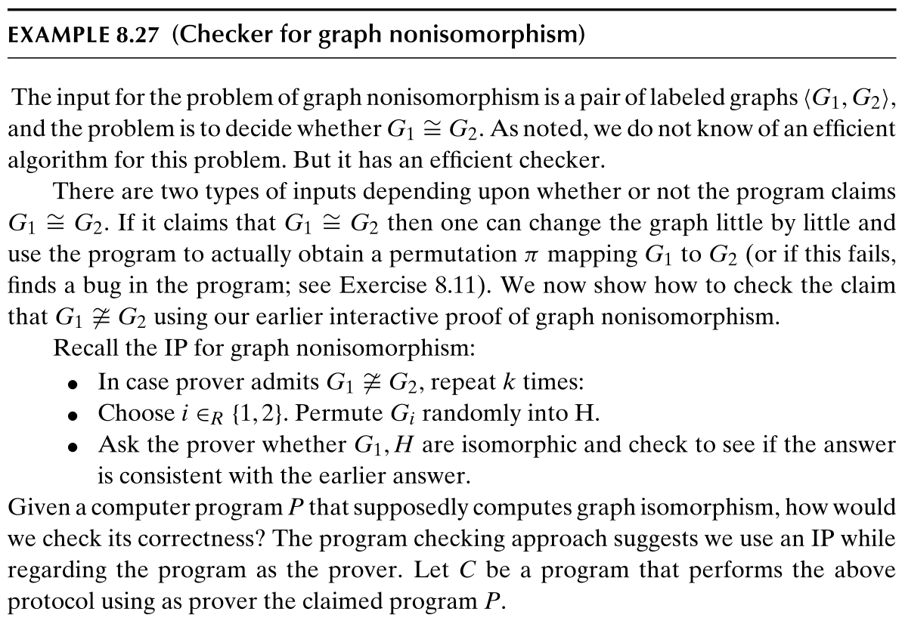
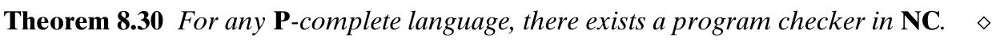

# 8 - 交互式证明

> 交互式证明中不限制证明者的计算能力，但是限制验证者的计算能力

## 8.1 交互式证明：一些变体

### 8.1.1 有确定性验证者和证明者的交互式证明

定义确定性函数的迭代：

定义确定性证明系统：

有

### 8.1.2 类 IP：概率性验证者

其中的常数同样可以替换：

需要注意的是 IP 中的随机位只有验证者可见，称为私有硬币。

### 8.1.3 图非同构的交互式证明

**零知识证明**：是一个与交互证明相关的主题，是密码学中一项巨大的研究工作的基础。粗略地说，语言成员资格的零知识证明系统是一个交互式证明协议，其中验证者最终确信输入x是该语言的，但除此之外什么也没学到。

## 8.2 公共硬币与 AM

定义具有公共硬币的交互式证明：

使用 $\bf AM$ 表示 $\bf AM[2]$。

有：

1. 
2. 
3. 

### 8.2.1 模拟私有硬币

证明中使用到了集合下界协议。

### 8.2.2 集合下界协议

定义成对独立散列函数：

集合下界协议即为：

思想是当 S 大于 K 时，能够找到属于 S 的 x 的概率很大，但当 S 小于 K/2 时，给一个 y，能够找到对应的 x 的概率较小，因为值域大于定义域（粗略理解）。

### 8.2.3 证明梗概

在私有硬币中，概率由验证者的随机位串保证；而在公共硬币中，可以通过验证者提供一个公开的随机选择哈希函数，然后由证明者向验证者证明某些消息很可能是验证者发送的，也即计算得到哈希的输入，随机性由集合的下界保证。因此加两轮交互就可以模拟私有硬币。

### 8.2.4 GI 可能是 NP-完全吗？

## 8.3 IP = PSPACE

## 8.4 证明者的能力

许多已知的交互式证明系统的一个奇怪的特征是，为了证明语言L中的成员资格，证明者需要进行比仅仅决定语言L中的成员资格更强大的计算。

协议是否可以被重新设计以使用更弱的证明者是一个公开的问题。

*不清楚该定理的意义。*

## 8.5 多证明者交互式证明（MIP）

还可以定义涉及多个证明者的交互式证明。重要的假设是证明者在协议期间不相互通信。他们可以在协议开始前进行沟通，特别是就回答问题的共同策略达成一致。人们经常打比方说，警察在不同的房间里审讯两个嫌疑犯。嫌疑人可能是共犯，他们决定向警方讲述一个共同的故事，但由于他们是分开审讯的，他们可能会无意中透露故事中的不一致之处。

显然$\bf IP\sube MIP$，但是 $\bf MIP$ 很有可能严格大于 $\bf IP$（除非 $\bf PSPACE=NEXP$）：

令类 ${\bf PCP}[r,q]$ 是能够使用大小为 $2^r$ 的表和 $q$ 次查询证明的语言的集合，则有：

## 8.6 程序检查

观察到即使程序验证——决定给定程序是否在所有输入上解决某个计算任务——是不可确定的，在许多情况下，在逐个输入的基础上对程序的“正确性”有更弱的保证就足够了。

C 的任务即检查程序在特定输入上的答案是否不正确。

对于图非同构问题，存在检查器 $C$：

它的定义为：

### 8.6.1 有检查器的语言

### 8.6.2 随机自规约性和积和式（permanent）（不懂）

随机自规约：

积和式的定义：

## 8.7 积和式的交互式证明

